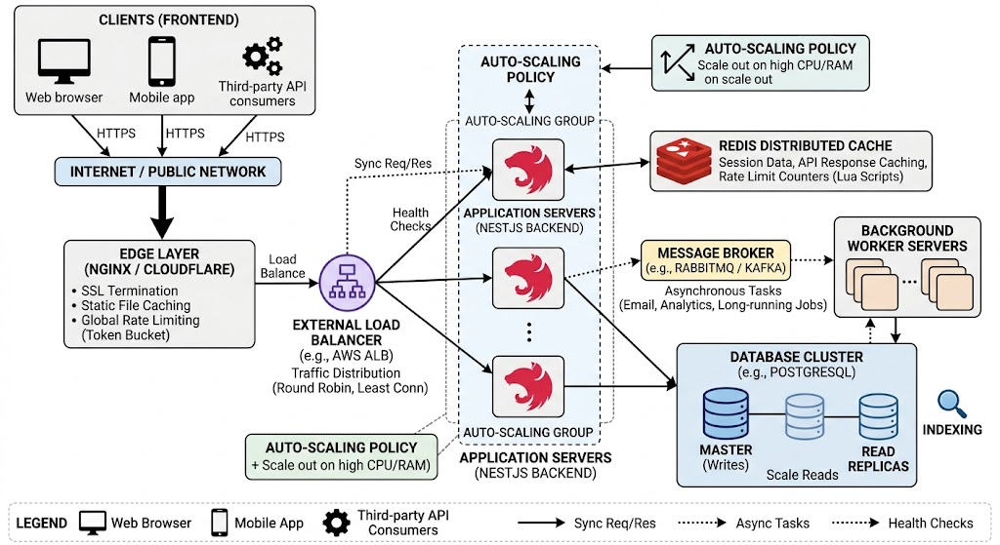

# Rate Limiting

রেট লিমিটিং হলো— কোনো একজন ইউজার বা কোনো একটি নির্দিষ্ট সার্ভিস একটি নির্দিষ্ট সময়ের মধ্যে কতবার রিকোয়েস্ট পাঠাতে পারবে, তার সীমা নির্ধারণ করে দেওয়া। রেট লিমিটিং এর মূল উদ্দেশ্য হলো System Overload এবং Abuse (যেমন: Brute force attack বা DDoS) ঠেকানো।

## কিভাবে কাজ করে (Under-the-hood Algorithms):

রেট লিমিটিং কাজ করার জন্য মূলত ৪টি জনপ্রিয় অ্যালগরিদম ব্যবহার করা হয়:

- Token Bucket: ধরুন একটি বালতিতে টোকেন জমা হচ্ছে। প্রতি রিকোয়েস্টে একটি করে টোকেন খরচ হয়। বালতি খালি হয়ে গেলে আর রিকোয়েস্ট নেওয়া হয় না। এটি হঠাৎ আসা অনেক বেশি রিকোয়েস্ট (Burst traffic) সামলাতে পারে।
- Leaky Bucket: বালতির নিচে ছোট ফুটো আছে। রিকোয়েস্ট যে গতিতেই আসুক না কেন, সিস্টেম একটি নির্দিষ্ট গতিতে (Constant rate) সেগুলো প্রসেস করে। এটি ট্রাফিককে স্মুথ করে দেয়।

- Fixed Window Counter: যেমন— "১ মিনিটে সর্বোচ্চ ১০০ রিকোয়েস্ট"। মিনিট শেষ হলে কাউন্টার রিসেট হয়। এর সমস্যা হলো, মিনিটের শেষ সেকেন্ডে এবং পরের মিনিটের প্রথম সেকেন্ডে অনেক রিকোয়েস্ট চলে আসতে পারে।

- Sliding Window Log/Counter: এটি সময়ের একটি নির্দিষ্ট উইন্ডো মুভ করতে থাকে, ফলে রিকোয়েস্টের হিসাব অনেক বেশি নিখুঁত হয়।

## Real-world Use Case: Scalability vs. Complexity

উদাহরণ: ধরুন আপনি একটি SMS গেটওয়ে বা API সার্ভিস দিচ্ছেন।

- Scalability: রেট লিমিটিং থাকলে আপনার ডাটাবেস বা ডাউনস্ট্রিম সার্ভিসগুলো হঠাৎ রিকোয়েস্টের চাপে ভেঙে পড়ে না। এটি সিস্টেমকে লিনিয়ার স্কেলিং করতে সাহায্য করে।

- Complexity: এটি ইমপ্লিমেন্ট করতে হলে আপনাকে একটি ফাস্ট স্টোরেজ ব্যবহার করতে হয় (যেমন Redis), কারণ প্রতি রিকোয়েস্টে ডেটাবেস চেক করা সম্ভব নয়। এখানে ডিসট্রিবিউটেড সিস্টেমের ক্ষেত্রে 'Race Condition' তৈরি হতে পারে, যা ম্যানেজ করা বেশ জটিল।

## Edge Cases & Common Failure Points

- Shared Infrastructure: যদি আপনার রেট লিমিটিং লেয়ার (যেমন Redis) ডাউন হয়ে যায়, তবে কি আপনি সব রিকোয়েস্ট অ্যালাউ করবেন (Fail-open), নাকি সব ব্লক করবেন (Fail-close)? সাধারণত 'Fail-open' করা হয় যাতে ইউজার এক্সপেরিয়েন্স নষ্ট না হয়।

- Distributed Systems: যখন মাল্টিপল সার্ভার থাকে, তখন একটি কমন Redis ব্যবহার না করলে একেক সার্ভারে একেক রকম লিমিট হতে পারে।

- Identification: আপনি কাকে লিমিট করছেন? IP অ্যাড্রেস দিয়ে? নাকি ইউজার ID দিয়ে? পাবলিক ওয়াইফাই ব্যবহার করলে অনেক ইউজারের IP একই হতে পারে, যা ভুলবশত অনেককে ব্লক করে দিতে পারে।

## ১ মিলিয়ন ইউজার বাড়লে কী করবেন?

যখন বলা হয় "হঠাৎ ট্রাফিক ১ মিলিয়ন বেড়ে গেল", তখন আপনার উত্তর হবে তিনটি স্তরে:

- Global Rate Limiting (Edge Layer): প্রথমেই বলবেন, আপনি শুধু অ্যাপ সার্ভারে কোড লিখবেন না। আপনি Cloudflare বা AWS WAF-এর মতো এজ লেভেলে লিমিট সেট করবেন যাতে ব্যাড ট্রাফিক আপনার মেইন সার্ভার পর্যন্ত আসতেই না পারে।
- Distributed Rate Limiting: যেহেতু আপনার ১টি সার্ভার নেই, তাই সব সার্ভার মিলে একটি শেয়ারড মেমোরি (Redis) ব্যবহার করবে। এখানে Race Condition হতে পারে (দুটি সার্ভার একসাথে Redis আপডেট করতে চাইলে)। এর সমাধান হিসেবে Lua Scripts ব্যবহার করার কথা বলবেন। এতে অপারেশনটি 'Atomic' হয়।
- Tiered Rate Limiting: সব ইউজারকে একই চোখে দেখা যাবে না।
  > Public/Guest: খুব কড়া লিমিট।
  > Authenticated User: একটু বেশি লিমিট।
  > Premium/Tiered API: টাকা অনুযায়ী বড় লিমিট।

`Ans`

1. The Strategy: "আমি এই সমস্যাটিকে Multi-layered Defense বা Defense in Depth অ্যাপ্রোচে সমাধান করবো। আমার মূল গোল হবে দুটি: প্রথমত, সিস্টেমকে অ্যাটাক বা ওভারলোড থেকে রক্ষা করা, এবং দ্বিতীয়ত, জেনুইন ইউজারদের জন্য ফেয়ারনেস (Fairness) নিশ্চিত করা।"
2. The Layers: আপনি বলবেন যে আপনি ৩টি লেভেলে রেট লিমিটিং এবং ট্রাফিক ম্যানেজমেন্ট করবেন:

- স্তর ১: Edge/Infrastructure Layer (Load Balancer/Gateway)
  "শুরুতেই আমি Nginx, AWS WAF বা Cloudflare-এর মতো এজ লেভেলে একটি গ্লোবাল লিমিট বসাবো। এখানে আমি মূলত Leaky Bucket অ্যালগরিদম পছন্দ করি কারণ এটি ব্যাকএন্ডে ট্রাফিকের একটি স্মুথ ফ্লো নিশ্চিত করে। এটি করার ফলে DDoS বা বট অ্যাটাকগুলো আমার মেইন অ্যাপ্লিকেশন সার্ভার পর্যন্ত পৌঁছাতেই পারবে না।"

- স্তর ২: Application Layer (Business Logic)
  "এরপর আমি আমার NestJS অ্যাপ্লিকেশনে Token Bucket অ্যালগরিদম ব্যবহার করবো (যেমন: @nestjs/throttler এবং Redis দিয়ে)। এখানে আমি বিজনেস লজিক অনুযায়ী লিমিট সেট করবো। যেমন:

  > গেস্ট ইউজারের জন্য মিনিটে ১০টি রিকোয়েস্ট।
  > প্রিমিয়াম ইউজারের জন্য মিনিটে ১০০টি রিকোয়েস্ট। এটি নিশ্চিত করবে যে একজন ইউজার অন্য ইউজারের রিসোর্স দখল করতে পারছে না।"

- স্তর ৩: Database/Service Layer (Load Shedding)
  "যদি ট্রাফিক ১ মিলিয়ন হয়ে যায় এবং আমার ওপরের দুই লেয়ার পাস করেও অনেক রিকোয়েস্ট আসে, তবে আমি Load Shedding টেকনিক ব্যবহার করবো। অর্থাৎ, আমি নন-ক্রিটিক্যাল রিকোয়েস্টগুলো (যেমন: এনালিটিক্স বা নোটিফিকেশন) ড্রপ করে দিয়ে শুধু ক্রিটিক্যাল রিকোয়েস্টগুলো (যেমন: পেমেন্ট বা অর্ডার) প্রসেস করবো।"

3. The Technical Depth

- Distributed State: "আমি ইন-মেমোরি ক্যাশ ব্যবহার না করে Redis ব্যবহার করবো যাতে মাল্টিপল সার্ভার ইন্সট্যান্স থাকলেও রেট লিমিটিং স্টেট সিনক্রোনাইজড থাকে।"
- Race Condition: "রেডিস-এ কাউন্টার আপডেট করার সময় রেস কন্ডিশন এড়াতে আমি `Lua Scripts` ব্যবহার করবো যাতে অপারেশনটি অ্যাটমিক হয়।"
- User Experience: "ইউজারকে শুধু ব্লক করবো না, রেসপন্স হেডারে `Retry-After` এবং `X-RateLimit-Remaining` পাঠিয়ে দেবো যাতে ক্লায়েন্ট সাইড থেকে হ্যান্ডেল করা সহজ হয়।"

4. The Trade-offs: "অবশেষে, আমি জানি যে ডাবল লেয়ার লিমিটিং সিস্টেমে কিছুটা Latency বাড়তে পারে এবং এটি আর্কিটেকচারাল জটিলতা বাড়ায়। কিন্তু হাই-এভেইলিবিলিটি এবং সিকিউরিটির জন্য এই ট্রেড-অফটি নেওয়া প্রয়োজন।"

## যদি তারা জিজ্ঞেস করে, "১ মিলিয়ন ইউজার হঠাৎ চলে আসলে আপনার রেডিস যদি ডাউন হয় তখন কী করবেন?"

আমি একটি Fail-safe মেকানিজম রাখবো। যদি রেডিস কানেক্টিভিটি ফেইল করে, তবে সিস্টেম অটোমেটিক 'Fail-Open' হবে (সব রিকোয়েস্ট যেতে দিবে) অথবা প্রতিটা সার্ভার তার লোকাল মেমোরি ব্যবহার করে লিমিটিং শুরু করবে (Fallback to In-memory limit)

---

Bonus:

- Write Buffering: সরাসরি ডিবি-তে রাইট না করে Redis বা Kafka-তে ডেটা পুশ করে দিন। পরে ধীরে ধীরে ডাটাবেসে সেভ করুন।
- Read Replicas: শুধু পড়ার (Read) জন্য আলাদা ডাটাবেস সার্ভার ব্যবহার করুন, যাতে মেইন ডিবি-র ওপর চাপ না পড়ে।
- Caching: যে ডেটাগুলো বারবার পরিবর্তন হয় না, সেগুলো ডাটাবেস থেকে না নিয়ে রেডিস থেকে দিন।

---

## API Gateway

API Gateway হলো একটি রিভার্স প্রক্সি (Reverse Proxy) যা ক্লায়েন্ট এবং ব্যাকএন্ড সার্ভিসের মাঝে বসে থাকে।

### Key Responsibilities

- Routing: ইউজার যখন /orders এ রিকোয়েস্ট পাঠায়, গেটওয়ে জানে এটাকে অর্ডার সার্ভিসে পাঠাতে হবে। আবার /payments আসলে সেটাকে পেমেন্ট সার্ভিসে পাঠাবে।
- Authentication & Authorization: প্রতিটা আলাদা সার্ভিসে লগইন চেক করার বদলে গেটওয়েতেই একবার চেক করা হয় ইউজার ভ্যালিড কি না।
- Rate Limiting: যেটা নিয়ে আমরা আগে আলোচনা করেছি, গেটওয়ে লেভেলে এই লিমিট বসানো সবথেকে বেশি কার্যকর।
- Load Balancing: গেটওয়ে নিজেই ইন্টারনাল লোড ব্যালেন্সার হিসেবে কাজ করে ট্রাফিক ডিস্ট্রিবিউট করতে পারে।
- Protocol Translation: হয়তো ক্লায়েন্ট কথা বলছে HTTP/JSON এ, কিন্তু আপনার ইন্টারনাল সার্ভিস কথা বলে gRPC-তে। গেটওয়ে এই কনভার্সনটা করে দেয়।

### Real-world Use Case: Scalability vs. Complexity

ধরুন আপনি একটি ই-কমার্স অ্যাপ চালাচ্ছেন।

- Scalability: আপনার সিস্টেম যত বড়ই হোক, ফ্রন্টএন্ড বা মোবাইল অ্যাপকে মাত্র একটা URL জানলেই চলে। আপনি পেছনে ১টি সার্ভিসের জায়গায় ১০০টি সার্ভিস বসালেও ইউজারের অ্যাপে কোনো কোড চেঞ্জ করতে হয় না।
- Complexity: গেটওয়ে অ্যাড করার মানে হলো সিস্টেমে নতুন একটি লেয়ার বাড়ানো। যদি গেটওয়ে ঠিকমতো কনফিগার করা না থাকে, তবে এটি নিজেই একটি Single Point of Failure (SPOF) হয়ে যেতে পারে (গেটওয়ে ডাউন তো পুরো সিস্টেম ডাউন)।

### Edge Cases & Common Failure Points

- Latency: যেহেতু প্রতিটি রিকোয়েস্ট গেটওয়ে হয়ে যায়, তাই সামান্য হলেও একটু সময় (latency) বেশি লাগে। যদি গেটওয়েতে অনেক বেশি লজিক (যেমন হেভি ডেটা ট্রান্সফরমেশন) লিখে ফেলেন, তবে সিস্টেম স্লো হয়ে যাবে।
- Gateway Overload: গেটওয়ে যদি সব রিকোয়েস্টের লগ জমা করতে গিয়ে মেমোরি শেষ করে ফেলে, তবে পুরো ইনফ্রাস্ট্রাকচার থমকে যাবে।
- SSL Termination: গেটওয়েতেই এনক্রিপশন হ্যান্ডেল করা হয়, তাই হাই ট্রাফিকের সময় CPU স্পাইক করতে পারে।
  

**সারকথা: API Gateway হলো একটা মাল্টি-টাস্কার। সে রাউটিংয়ের জন্য Trie, ডিস্ট্রিবিউশনের জন্য Hashing, আর প্রোটেকশনের জন্য Token Bucket—সবগুলো একসাথে ম্যানেজ করে।**