# Introduction to Two Pointers

## Intuition
As the name implies, a **two-pointer** pattern refers to an algorithm that utilizes two pointers.

### What is a pointer?
A pointer is a variable that represents an **index** or **position** within a data structure, such as:
*   An array
*   A linked list

Many algorithms typically use a single pointer to access or keep track of a single element at a time. The two-pointer approach expands on this by tracking two different positions simultaneously to optimize performance.

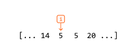

Introducing a second pointer opens a new world of possibilities. Most importantly, we can now make comparisons. With pointers at two different positions, we can compare the elements at those positions and make decisions based on the comparison:

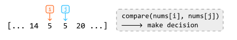

In many cases, such comparisons are made using two nested for-loops, which takes $O(n^2)$ time, where $n$ denotes the length of the data structure.

In the code snippet below, `i` and `j` are two pointers used to compare every two elements of an array:

```python
for i in range(n):
    for j in range(i + 1, n):
        compare(nums[i], nums[j])
```

```cpp
for (int i = 0; i < n; i++) {
    for (int j = i + 1; j < n; j++) {
        compare(nums[i], nums[j])
    }
}
```

Often, this approach does not take advantage of predictable dynamics that might exist in a data structure. An example of a data structure with predictable dynamics is a sorted array: when we move a pointer in a sorted array, we can predict whether the value being moved to is greater or smaller. For example, moving a pointer to the right in an ascending array guarantees we're moving to a value greater than or equal to the current one:

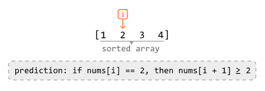

As you can see, data structures with predictable dynamics let us move pointers in a logical way. Taking advantage of this predictability can lead to improved time and space complexity, which we will illustrate with real interview problems in this chapter.

## Two-pointer Strategies

Two-pointer algorithms usually take only **$O(n)$** time by eliminating the need for nested for-loops. There are three main strategies for using two pointers.

### Inward Traversal
This approach has pointers starting at opposite ends of the data structure and moving inward toward each other:

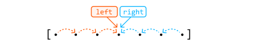

The pointers move toward the center, adjusting their positions based on comparisons, until a certain condition is met, or they meet/cross each other. This is ideal for problems where we need to compare elements from different ends of a data structure.

### Unidirectional traversal
In this approach, both pointers start at the same end of the data structure (usually the beginning) and move in the same direction:

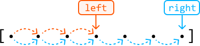

These pointers generally serve two different but supplementary purposes. A common application of this is when we want one pointer to find information (usually the right pointer) and another to keep track of information (usually the left pointer).

### Staged traversal
In this approach, we traverse with one pointer, and when it lands on an element that meets a certain condition, we traverse with the second pointer:

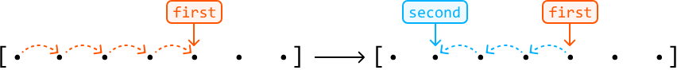

Similar to unidirectional traversal, both pointers serve different purposes. Here, the first pointer is used to search for something, and once found, a second pointer finds additional information concerning the value at the first pointer.

We discuss all of these techniques in detail throughout the problems in this chapter.


## When To Use Two Pointers?
A two-pointer algorithm usually requires a linear data structure, such as an array or linked list. Otherwise, an indication that a problem can be solved using the two-pointer algorithm, is when the input follows a predictable dynamic, such as a sorted array.

Predictable dynamics can take many forms. Take, for instance, a palindromic string. Its symmetrical pattern allows us to logically move two pointers toward the center. As you work through the problems in this chapter, you'll learn to recognize these predictable dynamics more easily.

Another potential indicator that a problem can be solved using two pointers is if the problem asks for a pair of values or a result that can be generated from two values.


### Real-world Example
Garbage collection algorithms: In memory compaction – which is a key part of garbage collection – the goal is to free up contiguous memory space by eliminating gaps left by deallocated (aka dead) objects. A two-pointer technique helps achieve this efficiently: a 'scan' pointer traverses the heap to identify live objects, while a 'free' pointer keeps track of the next available space to where live objects should be relocated. As the 'scan' pointer moves, it skips over dead objects and shifts live objects to the position indicated by the 'free' pointer, compacting the memory by grouping all live objects together and freeing up continuous blocks of memory.

## Chapter Outline

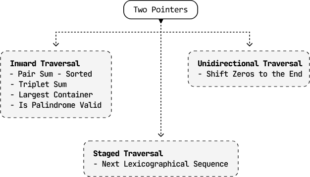

The two-pointer pattern is very versatile and, consequently, quite broad. As such, we want to cover more specialized variants of this algorithm in separate chapters, such as Fast and Slow Pointers and Sliding Windows.


## Pair Sum - Sorted

Given an array of integers sorted in ascending order and a target value, return the indexes of any pair of numbers in the array that sum to the target. The order of the indexes in the result doesn't matter. If no pair is found, return an empty array.

### Example 1:
```bash
Input: nums = [-5, -2, 3, 4, 6], target = 7
Output: [2, 3]
```
Explanation: nums[2] + nums[3] = 3 + 4 = 7

### Example 2:
```bash
Input: nums = [1, 1, 1], target = 2
Output: [0, 1]
```

Explanation: other valid outputs could be [1, 0], [0, 2], [2, 0], [1, 2] or [2, 1].

### Intuition
The brute force solution to this problem involves checking all possible pairs. This is done using two nested loops: an outer loop that traverses the array for the first element of the pair, and an inner loop that traverses the rest of the array to find the second element. Below is the code snippet for this approach:

```python
from typing import List

def pair_sum_sorted_brute_force(nums: List[int], target: int) -> List[int]:
    n = len(nums)
    for i in range(n):
        for j in range(i + 1, n):
            if nums[i] + nums[j] == target:
                return [i, j]
    return []
```

```js
export function pair_sum_sorted_brute_force(nums, target) {
  for (let i = 0; i < nums.length; i++) {
    for (let j = i + 1; j < nums.length; j++) {
      if (nums[i] + nums[j] === target) {
        return [i, j]
      }
    }
  }
  return []
}
```

This approach has a time complexity of $O(n^2)$, where $n$ denotes the length of the array. This approach does not take into account that the input array is sorted. Could we use this fact to come up with a more efficient solution?

A **two-pointer approach** is worth considering here because a sorted array allows us to move the pointers in a logical way. Let's see how this works in the example below:

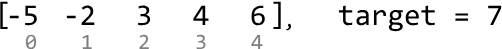

A good place to start is by looking at the smallest and largest values: the first and last elements, respectively. The sum of these two values is
1. 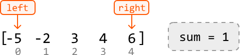

Since 1 is less than the target, we need to move one of our pointers to find a new pair with a larger sum.

*   **Left pointer:** The left pointer will always point to a value less than or equal to the value at the right pointer because the array is sorted. Incrementing it would result in a sum greater than or equal to the current sum of 1.
*   **Right pointer:** Decrementing the right pointer would result in a sum that’s less than or equal to 1.

Therefore, we should **increment the left pointer** to find a larger sum:
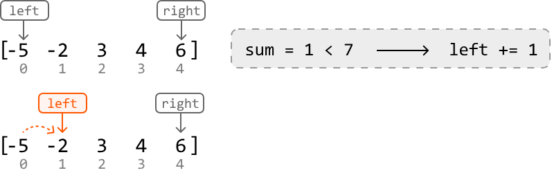

Again, the sum of the values at those two pointers (4) is too small. So, let's increment the left pointer:

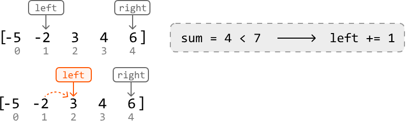

Now, the sum (9) is too large. So, we should decrement the right pointer to find a pair of values with a smaller sum:

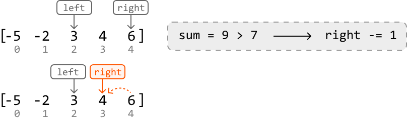

Finally, we found two numbers that yield a sum equal to the target. Let’s return their indexes:

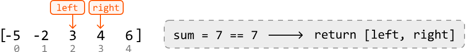

Above, we’ve demonstrated a two-pointer algorithm using **inward traversal**. Let’s summarize this logic. For any pair of values at `left` and `right`:

*   **If sum < target:** Increment `left`, aiming to increase the sum towards the target value.
*   **If sum > target:** Decrement `right`, aiming to decrease the sum towards the target value.
*   **If sum == target:** Return `[left, right]`.

We can stop moving the `left` and `right` pointers when they meet, as this indicates no pair summing to the target was found.

```python
from typing import List
       
def pair_sum_sorted(nums: List[int], target: int) -> List[int]:
    left, right = 0, len(nums) - 1
    while left < right:
        sum = nums[left] + nums[right]
        # If the sum is smaller, increment the left pointer, aiming to increase the
        # sum towards the target value.
        if sum < target:
            left += 1
        # If the sum is larger, decrement the right pointer, aiming to decrease the
        # sum towards the target value.
        elif sum > target:
            right -= 1
        # If the target pair is found, return its indexes.
        else:
            return [left, right]
    return []
```

```js
export function pair_sum_sorted(nums, target) {
  let left = 0
  let right = nums.length - 1
  while (left < right) {
    const sum = nums[left] + nums[right]
    // If the sum is smaller, increment the left pointer, aiming to increase the
    // sum towards the target value.
    if (sum < target) {
      left += 1
    }
    // If the sum is larger, decrement the right pointer, aiming to decrease the
    // sum towards the target value.
    else if (sum > target) {
      right -= 1
    }
    // If the target pair is found, return its indexes.
    else {
      return [left, right]
    }
  }
  return []
}
```

## Complexity Analysis

*   **Time complexity:** The time complexity of `pair_sum_sorted` is **$O(n)$** because we perform approximately $n$ iterations using the two-pointer technique in the worst case.
*   **Space complexity:** We only allocated a constant number of variables, so the space complexity is **$O(1)$**.

## Test Cases

In addition to the examples already discussed, here are some other test cases you can use. These extra test cases cover different contexts to ensure the code works well across a range of inputs. Testing is important because it helps identify mistakes in your code, ensures the solution works for uncommon inputs, and brings attention to cases you might have overlooked.


| Input | Expected Output | Description |
| :--- | :--- | :--- |
| `nums = []`, `target = 0` | `[]` | Tests an empty array. |
| `nums = [1]`, `target = 1` | `[]` | Tests an array with just one element. |
| `nums = [2, 3]`, `target = 5` | `[0, 1]` | Tests a two-element array that contains a pair that sums to the target. |
| `nums = [2, 4]`, `target = 5` | `[]` | Tests a two-element array that doesn’t contain a pair that sums to the target. |
| `nums = [2, 2, 3]`, `target = 5` | `[0, 2]` or `[1, 2]` | Testing an array with duplicate values. |
| `nums = [-1, 2, 3]`, `target = 2` | `[0, 2]` | Tests if the algorithm works with a negative number in the target pair. |
| `nums = [-3, -2, -1]`, `target = -5` | `[0, 1]` | Tests if the algorithm works with both numbers of the target pair being negative. |

> [!TIP]
> **Interview Tip: Consider all information provided.**
> When interviewers pose a problem, they sometimes provide only the minimum amount of information required for you to start solving it. Consequently, it’s crucial to thoroughly evaluate all that information to determine which details are essential for solving the problem efficiently. In this problem, the key to arriving at the optimal solution is recognizing that the **input is sorted**.

## Triplet Sum

Given an array of integers, return all triplets `[a, b, c]` such that **$a + b + c = 0$**.

### Constraints
*   The solution must **not** contain duplicate triplets (e.g., `[1, 2, 3]` and `[2, 3, 1]` are considered duplicates).
*   If no such triplets are found, return an empty array.
*   Each triplet can be arranged in any order, and the output can be returned in any order.

### Example
**Input:** `nums = [0, -1, 2, -3, 1]`
**Output:** `[[-3, 1, 2], [-1, 0, 1]]`

### Intuition

A brute force solution involves checking every possible triplet in the array to see if they sum to zero. This can be done using three nested loops, iterating through each combination of three elements.

Duplicate triplets can be avoided by sorting each triplet, which ensures that identical triplets with different representations (e.g., `[1, 3, 2]` and `[3, 2, 1]`) are ordered consistently (e.g., `[1, 2, 3]`). Once sorted, we can add these triplets to a **hash set**. This way, if the same triplet is encountered again, the hash set will only keep one instance.

Below is the code snippet for this approach:

```python
from typing import List

def triplet_sum_brute_force(nums: List[int]) -> List[List[int]]:
    n = len(nums)
    # Use a hash set to ensure we don't add duplicate triplets.
    triplets = set()
    # Iterate through the indexes of all triplets.
    for i in range(n):
        for j in range(i + 1, n):
            for k in range(j + 1, n):
                if nums[i] + nums[j] + nums[k] == 0:
                    # Sort the triplet before including it in the hash set.
                    triplet = tuple(sorted([nums[i], nums[j], nums[k]]))
                    triplets.add(triplet)
    return [list(triplet) for triplet in triplets]
```

```js
export function triplet_sum_brute_force(nums) {
  const n = nums.length
  // Use a hash set to ensure we don't add duplicate triplets.
  const triplets = new Set()
  // Iterate through the indexes of all triplets.
  for (let i = 0; i < n; i++) {
    for (let j = i + 1; j < n; j++) {
      for (let k = j + 1; k < n; k++) {
        if (nums[i] + nums[j] + nums[k] === 0) {
          // Sort the triplet before including it in the hash set.
          const triplet = [nums[i], nums[j], nums[k]].sort((a, b) => a - b)
          triplets.add(triplet.toString()) // Convert to string to store in the set
        }
      }
    }
  }
  // Convert the string representations back to arrays of numbers
  return Array.from(triplets).map((t) => t.split(',').map(Number))
}
```

This solution is quite inefficient with a time complexity of **$O(n^3)$**, where $n$ denotes the length of the input array. How can we do better?

Let’s see if we can find at least one triplet that sums to 0. Notice that if we fix one of the numbers in a triplet, the problem can be reduced to finding the other two. This leads to the following observation:

> For any triplet `[a, b, c]`, if we fix `a`, we can focus on finding a pair `[b, c]` that sums to `-a` ($a + b + c = 0 \rightarrow b + c = -a$).

Sound familiar? That's because the problem of finding a pair of numbers that sum to a target has already been addressed by **Pair Sum - Sorted**. However, we can only use that algorithm on a sorted array. So, the first thing we should do is **sort the input**.

Consider the following example:
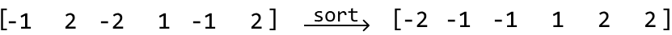
Now, starting at the first element, `-2` (i.e., 'a'), we'll use the `pair_sum_sorted` method on the rest of the array to find a pair whose sum equals `2` (i.e., '-a'):
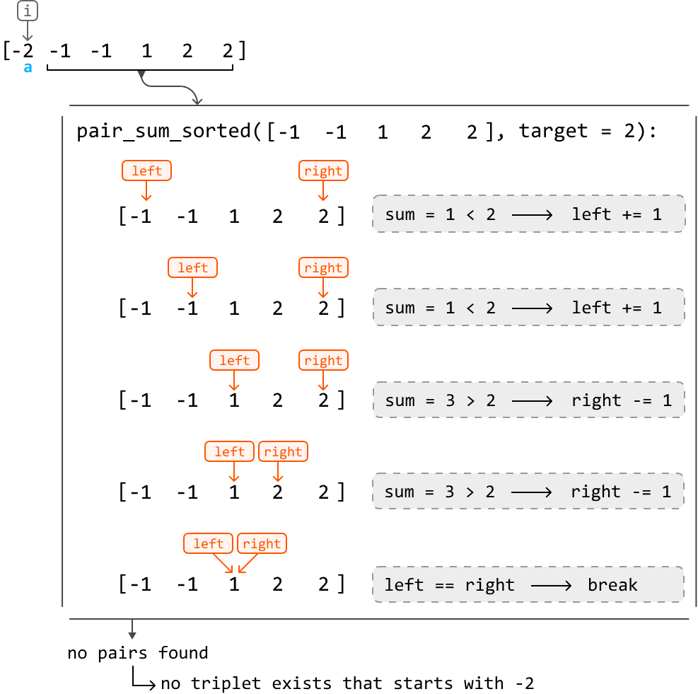
As you can see, when we called pair_sum_sorted, we did not find a pair with a sum of 2. This indicates that there are no triplets starting with -2 that add up to 0.
___

So, let's increment our main pointer, i, and try again.
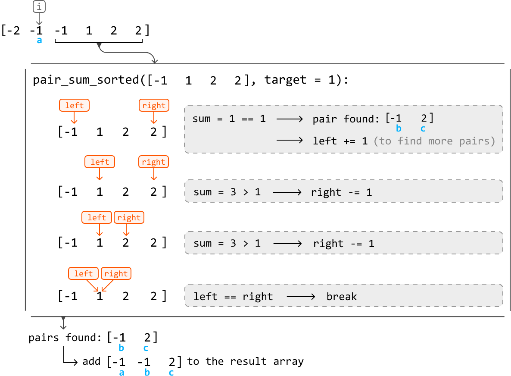
This time, we found one pair that resulted in a valid triplet.

If we continue this process for the rest of the array, we find that `[-1, -1, 2]` is the only triplet whose sum is 0.

There’s an important difference between the `pair_sum_sorted` implementation in **Pair Sum - Sorted** and the one in this problem: for this problem, we don’t stop when we find one pair—we keep going until all target pairs are found.

### Handling duplicate triplets
Something we previously glossed over is how to avoid adding duplicate triplets. There are two cases in which this happens. Consider the example below:
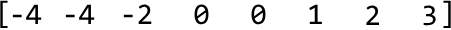
#### Case 1: Duplicate ‘a’ values

The first instance where duplicates may occur is when seeking pairs for triplets that start with the same ‘a’ value:

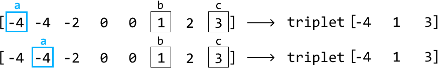

Since pair_sum_sorted would look for pairs that sum ‘-a’ in both instances, we’d naturally end up with the same pairs and, hence, the same triplets.

To avoid picking the same 'a' value, we keep increasing i (where num[i] represents the value 'a') until it reaches a different number from the previous one. We do this before we start looking for pairs using the pair_sum_sorted method. This logic works because the array is sorted, meaning equal numbers are next to each other. The code snippet for checking duplicate 'a' values looks like this:

```python
# To prevent duplicate triplets, ensure 'a' is not a repeat of the previous element
# in the sorted array.
if i > 0 and nums[i] == nums[i - 1]:
    continue
... Find triplets ...
```
```js
// To prevent duplicate triplets, ensure 'a' is not a repeat of the previous element
// in the sorted array.
if (i > 0 && nums[i] === nums[i - 1]) {
    continue;
}
... Find triplets ...
```
#### Case 2: Duplicate ‘b’ values

As for the second case, consider what happens during `pair_sum_sorted` when we encounter a similar issue. For a fixed target value (`-a`), pairs that start with the same number `b` will always be the same:

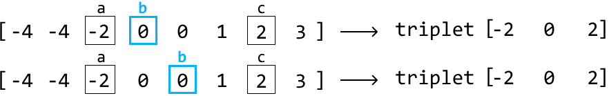
The remedy for this is the same as before: ensure the current ‘b’ value isn’t the same as the previous value.

It’s important to note that we don’t need to explicitly handle duplicate 'c' values. The adjustments made to avoid duplicate 'a' and 'b' values ensure each pair `[a, b]` is unique. Since `c` is determined by the equation $c = -(a + b)$, each unique `[a, b]` pair will result in a unique `c` value. Therefore, by just avoiding duplicates in `a` and `b`, we automatically avoid duplicates in the `[a, b, c]` triplets.

### Optimization
An interesting observation is that triplets that sum to 0 cannot be formed using positive numbers alone. Therefore, we can stop trying to find triplets once we reach a **positive ‘a’ value**, since this implies that ‘b’ and ‘c’ would also be positive.

### Implementation
From the above intuition, we know we need to slightly modify the `pair_sum_sorted` function to avoid duplicate triplets. We also need to pass in a `start` value to indicate the beginning of the subarray on which we want to perform the pair-sum algorithm. Otherwise, the two-pointer logic remains nearly identical to that of **Pair Sum - Sorted**.

```python
from typing import List

def triplet_sum(nums: List[int]) -> List[List[int]]:
    triplets = []
    nums.sort()
    for i in range(len(nums)):
        # Optimization: triplets consisting of only positive numbers will never sum
        # to 0.
        if nums[i] > 0:
            break
        # To avoid duplicate triplets, skip 'a' if it's the same as the previous
        # number.
        if i > 0 and nums[i] == nums[i - 1]:
            continue
        # Find all pairs that sum to a target of '-a' ('-nums[i]').
        pairs = pair_sum_sorted_all_pairs(nums, i + 1, -nums[i])
        for pair in pairs:
            triplets.append([nums[i]] + pair)
    return triplets

def pair_sum_sorted_all_pairs(nums: List[int], start: int, target: int) -> List[int]:
    pairs = []
    left, right = start, len(nums) - 1
    while left < right:
        sum = nums[left] + nums[right]
        if sum == target:
            pairs.append([nums[left], nums[right]])
            left += 1 # To avoid duplicate '[b, c]' pairs, skip 'b' if it’s the same as the # previous number.
            while left < right and nums[left] == nums[left - 1]:
                left += 1
        elif sum < target:
            left += 1
        else:
            right -= 1
    return pairs
```

```js
export function triplet_sum(nums) {
  const triplets = []
  nums.sort((a, b) => a - b)
  for (let i = 0; i < nums.length; i++) {
    // Optimization: triplets consisting of only positive numbers will never sum
    // to 0.
    if (nums[i] > 0) break
    // To avoid duplicate triplets, skip 'a' if it's the same as the previous
    // number.
    if (i > 0 && nums[i] === nums[i - 1]) continue
    // Find all pairs that sum to a target of '-a' ('-nums[i]').
    const pairs = pair_sum_sorted_all_pairs(nums, i + 1, -nums[i])
    for (const pair of pairs) {
      triplets.push([nums[i], ...pair])
    }
  }
  return triplets
}

function pair_sum_sorted_all_pairs(nums, start, target) {
  const pairs = []
  let left = start,
    right = nums.length - 1
  while (left < right) {
    const sum = nums[left] + nums[right]
    if (sum === target) {
      pairs.push([nums[left], nums[right]])
      left++
      // To avoid duplicate '[b, c]' pairs, skip 'b' if it’s the same as the
      // previous number.
      while (left < right && nums[left] === nums[left - 1]) {
        left++
      }
    } else if (sum < target) {
      left++
    } else {
      right--
    }
  }
  return pairs
}
```

## Complexity Analysis

*   **Time complexity:** The time complexity of `triplet_sum` is **$O(n^2)$**. Here’s why:
    1.  We first sort the array, which takes $O(n \log n)$ time.
    2.  Then, for each of the $n$ elements in the array, we call `pair_sum_sorted_all_pairs` at most once, which runs in $O(n)$ time.
    3.  Therefore, the overall time complexity is $O(n \log n) + O(n^2) = O(n^2)$.

*   **Space complexity:** The space complexity is **$O(n)$** due to the space taken up by the sorting algorithm (e.g., Timsort in Python). This does not include the output array because we are only concerned with the additional space used by the algorithm itself.
    *   *Note:* If the interviewer asks for space complexity including the output array, it would be **$O(n^2)$** since `pair_sum_sorted_all_pairs` can add $O(n)$ pairs and is called $O(n)$ times.

## Test Cases

In addition to the examples already covered, below are some others to consider when testing your code.


| Input | Expected Output | Description |
| :--- | :--- | :--- |
| `nums = []` | `[]` | Tests an empty array. |
| `nums = [0]` | `[]` | Tests a single-element array. |
| `nums = [1, -1]` | `[]` | Tests a two-element array. |
| `nums = [0, 0, 0]` | `[[0, 0, 0]]` | Tests an array where all three values are the same. |
| `nums = [1, 0, 1]` | `[]` | Tests an array with no triplets that sum to 0. |
| `nums = [0, 0, 1, -1, 1, -1]` | `[[-1, 0, 1]]` | Tests an array with duplicate values to ensure unique results. |
