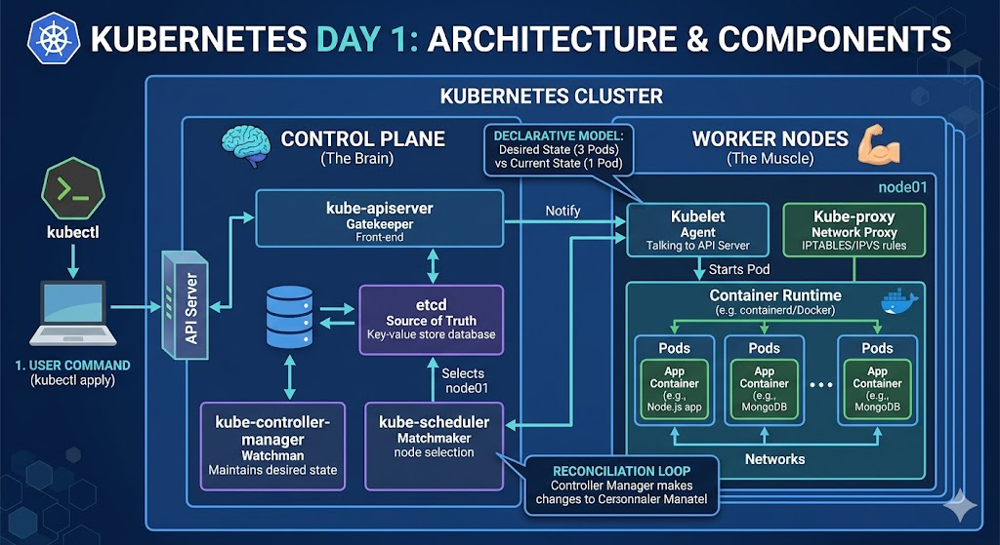

# Day 1: Architecture Deep Dive & Cluster Heartbeat

কুবারনেটিস ক্লাস্টারকে একটি বিশাল শিপিং ইয়ার্ডের মতো চিন্তা করুন। সেখানে একজন প্রধান ম্যানেজার (Control Plane) থাকে এবং অনেকগুলো শ্রমিক (Worker Nodes) থাকে।

1. Control Plane (মস্তিষ্ক)
মাস্টার নোড বা কন্ট্রোল প্লেনের ভেতরে ৪টি মেইন পার্ট থাকে। এদের কাজ হলো ক্লাস্টারের `"Desired State"` বজায় রাখা।

- `API Server (kube-apiserver)`: এটি ক্লাস্টারের একমাত্র গেটওয়ে। আপনি যখন kubectl কমান্ড দেন, এটি সেই রিকোয়েস্ট গ্রহণ করে। এটি ছাড়া ক্লাস্টার অচল।

- `etcd`: এটি একটি ডাটাবেস। ক্লাস্টারের সব ইনফরমেশন (কে কোথায় আছে, কয়টা পড চলছে) এখানে সেভ থাকে।

- `cheduler (kube-scheduler)`: এর কাজ হলো নতুন পডের জন্য উপযুক্ত নোড খুঁজে বের করা। সে দেখে কোন নোডে র‍্যাম বা সিপিইউ খালি আছে।

- `Controller Manager`: এটি হলো পাহারাদার। আপনি যদি ৩টি পড চান আর ১টি মারা যায়, তবে এই ম্যানেজারই নতুন একটি তৈরির নির্দেশ দেয়।

2. Worker Node (পেশি)

যেখানে আপনার আসল অ্যাপ বা কন্টেইনার চলে। প্রতিটি নোডে ৩টি জিনিস থাকে:

- `Kubelet`: নোডের প্রতিনিধি। সে এপিআই সার্ভার থেকে অর্ডার নেয় এবং কন্টেইনার রান করে।

- `Kube-proxy`: এটি নেটওয়ার্কিং রুলস হ্যান্ডেল করে। এক পড থেকে অন্য পডে ট্রাফিক পাঠায়।

- `Container Runtime`: আসল সফটওয়্যার যা কন্টেইনার চালায় (যেমন: Docker বা Containerd)।

