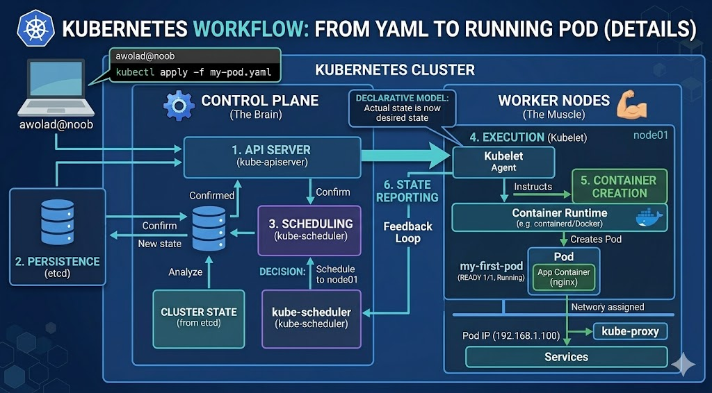

# From Yaml to Running POD

1. `USER COMMAND (awolad@noob)`: সবার শুরুতে আপনার ল্যাপটপে বসা এই আপনি! আপনি kubectl apply -f my-pod.yaml কমান্ড দিলেন।

2. `API SERVER`: আপনার কমান্ডটি সরাসরি গেল CONTROL PLANE-এর গেটওয়েতে। এপিআই সার্ভার রিকোয়েস্টটি নিয়ে নিল।

3. `PERSISTENCE (etcd)`: এপিআই সার্ভার সাথে সাথে আপনার অর্ডারের তথ্য ডাটাবেসে (etcd database) সেভ করে রাখলো। এই তথ্যটা ক্লাস্টারের "Source of Truth"।

4. `SCHEDULING (kube-scheduler)`: শিডিউলার দেখলো একটা নতুন পড চেয়েছে। সে তখন ক্লাস্টারের অবস্থা চেক করলো এবং ঠিক করলো আপনার পডটি docker-desktop নোডে যাবে।

5. `EXECUTION (Kubelet)`: এপিআই সার্ভার এবার আপনার নোডের ভেতরের এজেন্ট Kubelet-কে খবর দিল। কিউবেলেট দেখলো তার নোডে কাজ এসেছে।

6. `CONTAINER CREATION`: কিউবেলেট তখন কন্টেইনার রানটাইমকে (containerd/Docker) হুকুম দিল কন্টেইনার তৈরি করতে। কন্টেইনার তৈরি হয়ে গেল।

7. `STATE REPORTING`: সবশেষে, কিউবেলেট এপিআই সার্ভারকে খবর পাঠালো— "বস, কাজ হয়ে গেছে, পড এখন রানিং!" এপিআই সার্ভার ডাটাবেস আপডেট করলো, আর আপনি টার্মিনালে দেখলেন READY 1/1, Running।



---

1. Worker Node (অফিসের ডেস্ক বা কম্পিউটার)
   মনে করুন, আপনার কোম্পানিতে অনেকগুলো ডেস্ক (Node) আছে। একেকটি ডেস্কে বসে ডেভেলপাররা কাজ করে।

- কুবারনেটিসে Node হলো এক একটা ফিজিক্যাল মেশিন বা ভার্চুয়াল মেশিন
- নোডের নিজের কোনো বুদ্ধি নেই, সে শুধু জায়গা দেয় যাতে কাজ করা যায়।

2. Pod (অফিসের চেয়ার)
   কুবারনেটিসে আপনি সরাসরি কোনো কন্টেইনার (Docker Container) চালাতে পারবেন না। আপনাকে সেটা একটা Pod-এর ভেতরে রাখতে হবে।

- Pod হলো কন্টেইনারের জন্য একটা প্যাকেট বা কাভার।
- ডেস্কে (Node) যেমন সরাসরি কেউ মেঝেতে বসে কাজ করে না, চেয়ারে (Pod) বসে কাজ করে—ঠিক তেমনি কুবারনেটিসে অ্যাপ চলে পডের ভেতরে।
- এক একটি পডের ভেতরে এক বা একাধিক কন্টেইনার থাকতে পারে।

3. Kubelet (ডেস্কের সুপারভাইজার)
   প্রতিটি ডেস্কে (Node) একজন সুপারভাইজার (Kubelet) থাকে।

- সে মাস্টার অফিসের (API Server) দিকে তাকিয়ে থাকে। যখনই এপিআই সার্ভার বলে, "আওলাদের একটা পড এই ডেস্কে বসাও", তখন এই সুপারভাইজার (Kubelet) কন্টেইনার চালু করে দেয়।
- সে সবসময় চেক করে পডটা ঠিকঠাক চলছে কি না। পড মরে গেলে সে মাস্টারকে রিপোর্ট দেয়।

1. ফাইলটি রান

```bash
kubectl apply -f my-pod.yaml
```

2. রান হচ্ছে কি না চেক করুন

```bash
kubectl get pods
```

3. পডটি ঠিকমতো কাজ করছে কি না দেখুন

```bash
kubectl describe pod my-first-pod
```

## পর্দার আড়ালে যা ঘটছে

- আপনি যখন apply দিলেন, তখন আপনার পিসিতে থাকা কুবারনেটিস ইঞ্জিন নিচের কাজগুলো করছে:
- ১. API Server: আপনার YAML ফাইলটি রিসিভ করল।
- ২. Scheduler: আপনার পিসির ভেতর থাকা Worker Node (docker-desktop)-এ পডটি বসানোর জায়গা করে দিল।
- ৩. Kubelet: আপনার পিসির ডকারকে নির্দেশ দিল nginx:alpine ইমেজটি নামাতে এবং সেটিকে আপনি যে Resource Limits (128Mi RAM) দিয়েছেন তার মধ্যে আটকে রেখে চালু করতে।

`সারসংক্ষেপ:`
**Namespaces: কন্টেইনারকে আলাদা জগত দেখায় (যাতে অন্যকে দেখতে না পায়)।**

**PID: কন্টেইনারের ভেতরের প্রসেস আইডি ১ হিসেবে দেখায় (পরিচয়ের সুরক্ষা)।**

**Cgroups: কন্টেইনার কতটুকু র‍্যাম বা সিপিইউ ব্যবহার করবে তা নিয়ন্ত্রণ করে (রিসোর্স লিমিট)।**

আপনি যখন কুবারনেটিসে একটি পড তৈরি করেন, তখন ব্যাকগ্রাউন্ডে এই নেমস্পেস এবং সিগ্রুপের একটি চমৎকার কম্বিনেশন তৈরি হয়।
নিচে এর গভীর ডিসেকশন দেওয়া হলো:

1. `Shared Namespace`: একটি পডের ভেতরে যদি আপনি ২টি কন্টেইনার রাখেন, কুবারনেটিস তাদের জন্য একটি Common Network Namespace তৈরি করে। এর মানে হলো, তারা দুজন একই রুমের (Pod) বাসিন্দা এবং তাদের আইপি অ্যাড্রেস একটাই। এই কারণেই এক কন্টেইনার থেকে অন্য কন্টেইনারকে localhost দিয়ে কল করা যায়।

2. `Individual Cgroups`: যদিও তারা একই পডে থাকে, কিন্তু আপনি চাইলে প্রতিটা কন্টেইনারের জন্য আলাদা আলাদা Cgroups সেট করতে পারেন। যেমন: ব্যাকএন্ড কন্টেইনার পাবে ৫১২ এমবি র‍্যাম, কিন্তু লগ-কালেক্টর কন্টেইনার পাবে মাত্র ৬৪ এমবি।

3. `The Pause Container`: কুবারনেটিসের একটি গোপন ট্রিক আছে যা অনেক সিনিয়ররাও জানেন না। আপনি যখন পড বানান, কুবারনেটিস সবার আগে একটি "Pause Container" তৈরি করে। এই কন্টেইনারের একমাত্র কাজ হলো নেমস্পেসগুলোকে ধরে রাখা, যাতে আপনার মেইন কন্টেইনার ক্র্যাশ করলেও নেটওয়ার্ক বা আইপি হারিয়ে না যায়।

- Network Namespace: এটি প্রতিটি কন্টেইনারকে পোর্টের একটি আলাদা সেট দেয়।
- ম্যাজিক: আপনার উবুন্টু মেইন সার্ভারে ৩০০০ পোর্ট একবারই ব্যবহার করা যাবে। কিন্তু কুবারনেটিসের ভেতরে ১০টি আলাদা পড (Pod) থাকলে, প্রতিটি পড তার নিজস্ব Network Namespace এর ভেতরে ৩০০০ পোর্ট ব্যবহার করতে পারবে। তারা কেউ কারো সাথে কনফ্লিক্ট করবে না কারণ তাদের "ফ্ল্যাট নাম্বার" আলাদা বিল্ডিংয়ে (Namespace) অবস্থিত।
