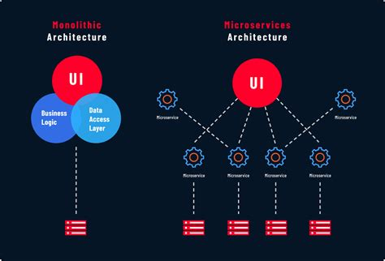
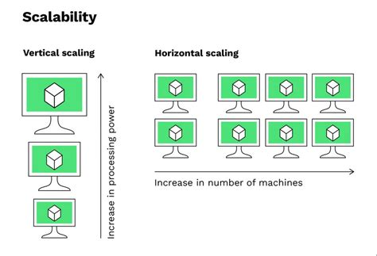

# What is System Design?

- সিস্টেম ডিজাইন হলো এমন একটি প্রক্রিয়া যার মাধ্যমে একটি অ্যাপ্লিকেশনের আর্কিটেকচার, মডিউল, ইন্টারফেস এবং ডাটা নির্ধারণ করা হয় যাতে সেটি ইউজারের চাহিদা পূরণ করতে পারে। এটি মূলত নির্ধারণ করে যে অ্যাপের বিভিন্ন অংশ (যেমন: ডাটাবেস, সার্ভার, ফ্রন্টএন্ড) একে অপরের সাথে কীভাবে যুক্ত থাকবে।

### Why is it important?

সিস্টেম ডিজাইন ছাড়া একটি বড় প্রজেক্ট তৈরি করা অসম্ভব। এর প্রধান কারণগুলো হলো:

- Scalability (স্কেলেবিলিটি): ধরুন আজ আপনার অ্যাপে ১০০ ইউজার আছে, কাল যদি ১ কোটি ইউজার আসে তবে আপনার অ্যাপ কি ক্র্যাশ করবে? সিস্টেম ডিজাইন শেখায় কীভাবে অ্যাপকে বড় করা যায়।

- Reliability (নির্ভরযোগ্যতা): ফেসবুক বা ইউটিউব কখনোই পুরোপুরি বন্ধ হয় না। সিস্টেম ডিজাইন নিশ্চিত করে যেন একটা সার্ভার নষ্ট হলেও পুরো সিস্টেম সচল থাকে।

- Cost Efficiency (খরচ কমানো): সঠিক ডিজাইন জানলে আপনি অহেতুক দামি সার্ভার না কিনে কম খরচে ভালো পারফরম্যান্স পাবেন।

- Maintainability (সহজ রক্ষণাবেক্ষণ): কোড বা সিস্টেম গুছিয়ে রাখলে ভবিষ্যতে নতুন ফিচার যোগ করা সহজ হয়।

### সিস্টেম ডিজাইনের প্রধান দুটি ধরন
`সিস্টেম ডিজাইনকে মূলত দুই ভাগে ভাগ করা যায়:`

- ক) Low-Level Design (LLD):
এটা হলো কোডিং লেভেলের ডিজাইন। এখানে অবজেক্ট অরিয়েন্টেড প্রোগ্রামিং (OOP), ক্লাস ডায়াগ্রাম এবং ডিজাইন প্যাটার্ন নিয়ে কাজ করা হয়। অর্থাৎ, ইন্টারনাল কোডগুলো কীভাবে সাজানো থাকবে।

- খ) High-Level Design (HLD):
এটা হলো সিস্টেমের ওপরের লেভেলের নকশা। এখানে সার্ভার, ডাটাবেস, লোড ব্যালেন্সার এবং নেটওয়ার্ক টপোলজি নিয়ে চিন্তা করা হয়। আমরা মূলত এই HLD নিয়েই বেশি আলোচনা করবো।

### Key Components

`একটি সিস্টেমে সাধারণত নিচের জিনিসগুলো নিয়ে কাজ করতে হয়:`

- Load Balancer: ট্রাফিক কন্ট্রোল করার জন্য।

- Web Servers: যেখানে আপনার মূল কোড চলে।

- Databases: যেখানে তথ্য জমা থাকে।

- Cache: দ্রুত ডাটা দেখানোর জন্য ছোট মেমোরি।

- Queue: কাজগুলোকে সিরিয়াল অনুযায়ী করার জন্য।

## Scalability

`আপনার সিস্টেমে ইউজারের সংখ্যা বাড়লে সিস্টেমটি সেই চাপ নিতে পারছে কি না, সেটাই হলো স্কেলেবিলিটি।`

ধরুন, আপনি একটি চায়ের দোকান দিলেন যেখানে ১ জন কর্মচারী প্রতিদিন ১০০ কাপ চা বানাতে পারে। হঠাৎ একদিন ১০০০ জন কাস্টমার চলে এলো। এখন ওই ১ জন কর্মচারী কিন্তু হিমশিম খাবে, কাস্টমাররা চা পাবে না।
সিস্টেমের ক্ষেত্রেও তাই। যখন আপনার অ্যাপে ট্রাফিক (ইউজার) বাড়ে, তখন সেই লোড সামলানোর জন্য সিস্টেমের ক্ষমতা বাড়ানোকেই বলে Scaling।

### Types of Scaling

`স্কেলিং প্রধানত দুই প্রকার। সিস্টেম ডিজাইনে এই দুটি পার্থক্য বোঝা সবচেয়ে জরুরি:`

**Vertical Scaling (Scaling Up)**
- এটি হলো আপনার বর্তমান সার্ভারের শক্তি বাড়িয়ে দেওয়া। যেমন: আপনার কম্পিউটারে ৮ জিবি র‍্যাম আছে, আপনি সেটাকে ৩২ জিবি করে দিলেন বা প্রসেসর শক্তিশালী করলেন।

1. সুবিধা: ম্যানেজ করা সহজ।
2. অসুবিধা: একটি নির্দিষ্ট সীমার পর হার্ডওয়্যার আর বাড়ানো যায় না (Limit আছে) এবং সার্ভার নষ্ট হলে পুরো সিস্টেম বন্ধ হয়ে যায়।

**Horizontal Scaling (Scaling Out)**
- এটি হলো একটি শক্তিশালী সার্ভারের বদলে অনেকগুলো সাধারণ সার্ভার যুক্ত করা। ১ জন সুপারম্যানের বদলে ১০ জন সাধারণ মানুষ দিয়ে কাজ করানো।

1. সুবিধা: অসীম পর্যন্ত বাড়ানো সম্ভব। একটি সার্ভার নষ্ট হলেও অন্যগুলো কাজ চালিয়ে নেয়।
2. অসুবিধা: এটি সেটআপ করা এবং মেইনটেইন করা বেশ জটিল।

### Scalability কিসের ওপর নির্ভর করে? (Key Factors)

`একটি সিস্টেম কতটা স্কেলেবল হবে তা প্রধানত ৩টি জিনিসের ওপর নির্ভর করে:`

1. Load (লোড): ইউজার সংখ্যা কত? প্রতি সেকেন্ডে কতগুলো রিকোয়েস্ট (Requests per second - RPS) আসছে? ডাটাবেসে কত ডাটা রিড/রাইট হচ্ছে?
2. Performance (পারফরম্যান্স): লোড বাড়লে সিস্টেম কি স্লো হয়ে যাচ্ছে? ল্যাটেন্সি (Latency) কেমন?
3. Resources (রিসোর্স): আপনার কাছে কতটুকু CPU, RAM, Network Bandwidth এবং স্টোরেজ আছে।

### Scalability-র সাথে অন্যান্য জিনিসের কানেকশন
`স্কেলেবিলিটি একা কাজ করে না, এর সাথে আরও কিছু কম্পোনেন্ট যুক্ত থাকে:`

- Load Balancer (লোড ব্যালেন্সার): যখন আপনি Horizontal Scaling করবেন (মানে অনেকগুলো সার্ভার রাখবেন), তখন কোন ইউজার কোন সার্ভারে যাবে সেটা ঠিক করে দেয় লোড ব্যালেন্সার।

- Database Scaling: শুধুমাত্র সার্ভার স্কেল করলে হয় না, ডাটাবেসকেও স্কেল করতে হয়। এখানে Replication এবং Sharding এর কনসেপ্ট আসে।

- Statelessness: সিস্টেম স্কেল করতে হলে সার্ভারকে 'Stateless' হতে হয়। অর্থাৎ সার্ভার যেন ইউজারের আগের তথ্য মনে না রাখে, যেন যেকোনো সার্ভার যেকোনো রিকোয়েস্ট হ্যান্ডেল করতে পারে।

### স্কেলেবিলিটি পরিমাপ (Measuring Scalability)

স্কেল করার আগে, এটি কীভাবে পরিমাপ করতে হয় তা বোঝা জরুরি। আপনি যা পরিমাপ করতে পারেন না, তা উন্নত করাও সম্ভব নয়। সুনির্দিষ্ট সংখ্যা বা ডেটা ছাড়া "আমাদের স্কেল করা দরকার" এর মতো অস্পষ্ট বক্তব্যের কোনো ভিত্তি থাকে না।

স্কেলেবিলিটি সাধারণত নিচের বিষয়গুলোর ওপর ভিত্তি করে মূল্যায়ন করা হয়:

### লোড মেট্রিক্স (Load Metrics)

| মেট্রিক (Metric) | বর্ণনা (Description) | উদাহরণ (Example) |
| :--- | :--- | :--- |
| রিকোয়েস্ট পার সেকেন্ড (RPS) | সিস্টেমটি প্রতি সেকেন্ডে কতগুলো API কল হ্যান্ডেল করতে পারে | ১০,০০০ RPS |
| কনকারেন্ট ইউজার (Concurrent users) | একই সময়ে কতজন ব্যবহারকারী সক্রিয় আছেন | ৫০,০০০ জন |
| ডেটা ভলিউম (Data volume) | প্রসেস করা বা স্টোর করা ডেটার পরিমাণ | ১০ TB স্টোরেজ |
| থ্রুপুট (Throughput) | প্রতি ইউনিট সময়ে কতটুকু ডেটা ট্রান্সফার হচ্ছে | ১ GB/s |
| কুয়েরি রেট (Query rate) | প্রতি সেকেন্ডে ডাটাবেস কুয়েরির সংখ্যা | ৫০,০০০ QPS |
| মেসেজ রেট (Message rate) | কিউ (Queue) এর মাধ্যমে প্রসেস হওয়া মেসেজের সংখ্যা | ১০০,০০০ msg/s |

### লোডের বিপরীতে পারফরম্যান্স (Performance Under Load)

একটি সিস্টেম তখনই ভালোভাবে স্কেল করে যখন লোড বাড়ার সাথে সাথে এটি গ্রহণযোগ্য পারফরম্যান্স বজায় রাখতে পারে। ভালো এবং খারাপ স্কেলিংয়ের পার্থক্য নিচে দেখানো হলো:

| লোড বৃদ্ধি (Load Increase) | রেসপন্স টাইম (Response Time) | আচরণ (Behavior) | এর অর্থ কী (What It Means) |
| :--- | :--- | :--- | :--- |
| ১x (বেজলাইন) | ৫০ms | বেজলাইন | স্বাভাবিক কার্যক্রম |
| ২x | ৫৫ms | চমৎকার | সাব-লিনিয়ার গ্রোথ, ক্যাশিং ভালো কাজ করছে |
| ৫x | ৭০ms | ভালো | সিস্টেম দক্ষতার সাথে লোড সামলাচ্ছে |
| ১০x | ১৫০ms | গ্রহণযোগ্য | লিনিয়ার ডিগ্রেডেশন, পারফরম্যান্স অনুমানযোগ্য |
| ১০x | ৫০০ms | উদ্বেগজনক | সুপার-লিনিয়ার ডিগ্রেডেশন, বটলনেক তৈরি হচ্ছে |
| ১০x | টাইমআউট (Timeout) | সংকটপূর্ণ | সিস্টেম ভেঙে পড়ার পর্যায়ে আছে |

মূল লক্ষ্য হলো লোড বাড়লেও পারফরম্যান্স তুলনামূলক স্থিতিশীল রাখা। আদর্শভাবে, আপনি **Linear** বা **Sublinear Degradation** চাইবেন, যেখানে লোড দ্বিগুণ হলেও রেসপন্স টাইম দ্বিগুণ হবে না। যখন রেসপন্স টাইম হঠাৎ বেড়ে যায় বা সিস্টেম টাইমআউট হতে শুরু করে, তখন বুঝতে হবে আপনি স্কেলেবিলিটির শেষ সীমায় পৌঁছেছেন।

**Bottlenecks**
`সিস্টেমের যে অংশটি সবচেয়ে দুর্বল এবং যার কারণে পুরো সিস্টেমের স্পিড কমে যায়, তাকেই Bottleneck বলে।`
- একটা বোতলের বডি যতই বড় হোক না কেন, বোতলটা উল্টালে পানি কত দ্রুত বের হবে তা নির্ভর করে তার সরু গলার (Neck) ওপর। ঠিক তেমনি, আপনার সিস্টেমে শত শত সুপার-ফাস্ট সার্ভার থাকতে পারে, কিন্তু যদি কোনো একটি অংশ স্লো হয়, তবে পুরো সিস্টেমটিই স্লো হয়ে যাবে। সেই স্লো অংশটিই হলো Bottleneck।

### সিস্টেম ডিজাইনে Bottlenecks কোথায় কোথায় হয়?

`সিস্টেমের মূলত এই জায়গাগুলোতে বোটলনেক দেখা দেয়:`

**Database Bottleneck (সবচেয়ে কমন)**
আপনার অ্যাপ্লিকেশন সার্ভার হয়তো সেকেন্ডে ১০,০০০ রিকোয়েস্ট নিতে পারে, কিন্তু আপনার ডাটাবেস সেকেন্ডে মাত্র ৫০০টি তথ্য সেভ করতে পারে। এখানে ডাটাবেস হলো বোটলনেক।

- সমাধান: ডাটাবেস ইনডেক্সিং করা অথবা ক্যাশিং (Caching) ব্যবহার করা।

**CPU/RAM Bottleneck**
আপনার কোড যদি খুব জটিল হয় (যেমন: ভিডিও প্রসেসিং বা ভারী ক্যালকুলেশন), তবে প্রসেসর বা র‍্যামের কারণে সিস্টেম স্লো হয়ে যেতে পারে।

- সমাধান: ভার্টিক্যাল স্কেলিং (র‍্যাম/প্রসেসর বাড়ানো)।

**Network Bottleneck**
সার্ভার এবং ডাটাবেসের মধ্যে যদি ডাটা আদান-প্রদানের রাস্তা (Bandwidth) সরু হয়, তবে ডাটা আসতে দেরি হবে। একে বলে নেটওয়ার্ক ল্যাটেন্সি।

- সমাধান: ভালো নেটওয়ার্ক ইনফ্রাস্ট্রাকচার বা CDN ব্যবহার করা।

**Disk I/O Bottleneck**
যদি হার্ডডিস্ক থেকে ডাটা পড়তে অনেক সময় লাগে (পুরানো HDD ব্যবহার করলে এমন হয়)।

- সমাধান: SSD ব্যবহার করা।

### Bottleneck কীভাবে খুঁজে বের করবেন?
`ইঞ্জিনিয়াররা সাধারণত কিছু জিনিস মনিটর করে বোটলনেক খুঁজে পান:`

- High CPU Usage: প্রসেসরে চাপ পড়ছে।
- High Memory Usage: র‍্যামে জায়গা নেই।
- Slow Query Logs: ডাটাবেস থেকে তথ্য আসতে দেরি হচ্ছে।
