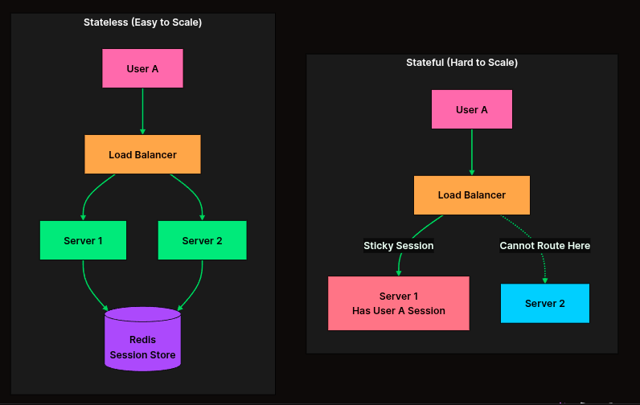
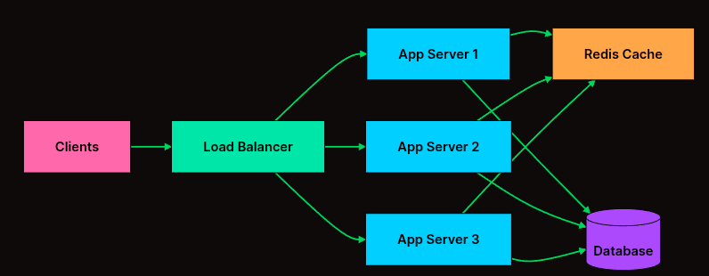
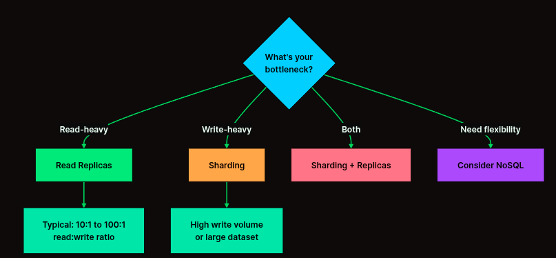

# What is System Design?

- সিস্টেম ডিজাইন হলো এমন একটি প্রক্রিয়া যার মাধ্যমে একটি অ্যাপ্লিকেশনের আর্কিটেকচার, মডিউল, ইন্টারফেস এবং ডাটা নির্ধারণ করা হয় যাতে সেটি ইউজারের চাহিদা পূরণ করতে পারে। এটি মূলত নির্ধারণ করে যে অ্যাপের বিভিন্ন অংশ (যেমন: ডাটাবেস, সার্ভার, ফ্রন্টএন্ড) একে অপরের সাথে কীভাবে যুক্ত থাকবে।

### Why is it important?

সিস্টেম ডিজাইন ছাড়া একটি বড় প্রজেক্ট তৈরি করা অসম্ভব। এর প্রধান কারণগুলো হলো:

- Scalability (স্কেলেবিলিটি): ধরুন আজ আপনার অ্যাপে ১০০ ইউজার আছে, কাল যদি ১ কোটি ইউজার আসে তবে আপনার অ্যাপ কি ক্র্যাশ করবে? সিস্টেম ডিজাইন শেখায় কীভাবে অ্যাপকে বড় করা যায়।

- Reliability (নির্ভরযোগ্যতা): ফেসবুক বা ইউটিউব কখনোই পুরোপুরি বন্ধ হয় না। সিস্টেম ডিজাইন নিশ্চিত করে যেন একটা সার্ভার নষ্ট হলেও পুরো সিস্টেম সচল থাকে।

- Cost Efficiency (খরচ কমানো): সঠিক ডিজাইন জানলে আপনি অহেতুক দামি সার্ভার না কিনে কম খরচে ভালো পারফরম্যান্স পাবেন।

- Maintainability (সহজ রক্ষণাবেক্ষণ): কোড বা সিস্টেম গুছিয়ে রাখলে ভবিষ্যতে নতুন ফিচার যোগ করা সহজ হয়।

### সিস্টেম ডিজাইনের প্রধান দুটি ধরন
`সিস্টেম ডিজাইনকে মূলত দুই ভাগে ভাগ করা যায়:`

- ক) Low-Level Design (LLD):
এটা হলো কোডিং লেভেলের ডিজাইন। এখানে অবজেক্ট অরিয়েন্টেড প্রোগ্রামিং (OOP), ক্লাস ডায়াগ্রাম এবং ডিজাইন প্যাটার্ন নিয়ে কাজ করা হয়। অর্থাৎ, ইন্টারনাল কোডগুলো কীভাবে সাজানো থাকবে।

- খ) High-Level Design (HLD):
এটা হলো সিস্টেমের ওপরের লেভেলের নকশা। এখানে সার্ভার, ডাটাবেস, লোড ব্যালেন্সার এবং নেটওয়ার্ক টপোলজি নিয়ে চিন্তা করা হয়। আমরা মূলত এই HLD নিয়েই বেশি আলোচনা করবো।

### Key Components

`একটি সিস্টেমে সাধারণত নিচের জিনিসগুলো নিয়ে কাজ করতে হয়:`

- Load Balancer: ট্রাফিক কন্ট্রোল করার জন্য।

- Web Servers: যেখানে আপনার মূল কোড চলে।

- Databases: যেখানে তথ্য জমা থাকে।

- Cache: দ্রুত ডাটা দেখানোর জন্য ছোট মেমোরি।

- Queue: কাজগুলোকে সিরিয়াল অনুযায়ী করার জন্য।

## Scalability

`আপনার সিস্টেমে ইউজারের সংখ্যা বাড়লে সিস্টেমটি সেই চাপ নিতে পারছে কি না, সেটাই হলো স্কেলেবিলিটি।`

ধরুন, আপনি একটি চায়ের দোকান দিলেন যেখানে ১ জন কর্মচারী প্রতিদিন ১০০ কাপ চা বানাতে পারে। হঠাৎ একদিন ১০০০ জন কাস্টমার চলে এলো। এখন ওই ১ জন কর্মচারী কিন্তু হিমশিম খাবে, কাস্টমাররা চা পাবে না।
সিস্টেমের ক্ষেত্রেও তাই। যখন আপনার অ্যাপে ট্রাফিক (ইউজার) বাড়ে, তখন সেই লোড সামলানোর জন্য সিস্টেমের ক্ষমতা বাড়ানোকেই বলে Scaling।

### Types of Scaling

`স্কেলিং প্রধানত দুই প্রকার। সিস্টেম ডিজাইনে এই দুটি পার্থক্য বোঝা সবচেয়ে জরুরি:`

**Vertical Scaling (Scaling Up)**
- এটি হলো আপনার বর্তমান সার্ভারের শক্তি বাড়িয়ে দেওয়া। যেমন: আপনার কম্পিউটারে ৮ জিবি র‍্যাম আছে, আপনি সেটাকে ৩২ জিবি করে দিলেন বা প্রসেসর শক্তিশালী করলেন।

1. সুবিধা: ম্যানেজ করা সহজ।
2. অসুবিধা: একটি নির্দিষ্ট সীমার পর হার্ডওয়্যার আর বাড়ানো যায় না (Limit আছে) এবং সার্ভার নষ্ট হলে পুরো সিস্টেম বন্ধ হয়ে যায়।

**কখন ব্যবহার করবেন?**
- শুরুতে: যখন ইউজার কম এবং আপনি দ্রুত কাজ শেষ করতে চান।
- সিম্পল অ্যাপ্লিকেশন: যেখানে ট্রাফিক খুব বেশি বাড়ে না।
- ডেটাবেস: কিছু রিলেশনাল ডাটাবেস (SQL) শুরুতে ভার্টিক্যাল স্কেলিং করলে ভালো পারফর্ম করে।

**Pros (সুবিধা):**
- সহজ ম্যানেজমেন্ট: আপনাকে একটি মাত্র সার্ভার দেখাশোনা করতে হয়।
- ডেটা কনসিস্টেন্সি: ডাটা এক জায়গায় থাকে বলে সিঙ্ক করার ঝামেলা নেই।
- খরচ কম (শুরুতে): অল্প ট্রাফিকের জন্য এটি সস্তা।

**Cons (অসুবিধা):**
- হার্ডওয়্যার লিমিট: একসময় গিয়ে আপনি আর বড় র‍্যাম বা প্রসেসর পাবেন না।
- Single Point of Failure: সার্ভারটি ডাউন হলে আপনার পুরো সার্ভিস বন্ধ।
- Downtime: হার্ডওয়্যার আপগ্রেড করার সময় সার্ভার বন্ধ রাখতে হতে পারে।

**Horizontal Scaling (Scaling Out)**
- এটি হলো একটি শক্তিশালী সার্ভারের বদলে অনেকগুলো সাধারণ সার্ভার যুক্ত করা। ১ জন সুপারম্যানের বদলে ১০ জন সাধারণ মানুষ দিয়ে কাজ করানো।

যখন একটি বিশাল শক্তিশালী সার্ভারও ট্রাফিকের চাপ নিতে পারে না বা যখন আপনি চান না যে একটি সার্ভার নষ্ট হলে পুরো সিস্টেম বন্ধ হয়ে যাক, তখনই Horizontal Scaling প্রয়োজন হয়।

এখানে একটি শক্তিশালী সার্ভার কেনার বদলে আমরা অনেকগুলো সাধারণ (Commodity) সার্ভার যোগ করি। গুগল, নেটফ্লিক্স বা অ্যামাজনের মতো কোম্পানিগুলো এভাবেই কোটি কোটি রিকোয়েস্ট হ্যান্ডেল করে। একটি Load Balancer এই সার্ভারগুলোর মধ্যে কাজ ভাগ করে দেয়।

1. সুবিধা:
- কোনো লিমিট নেই: আপনি যত খুশি সার্ভার যোগ করতে পারেন। ক্লাউড প্রোভাইডারদের (যেমন AWS, Google Cloud) কারণে এটি প্রায় অসীম।
- ফল্ট টলারেন্স (Fault Tolerance): একটি সার্ভার নষ্ট হলেও অন্যগুলো কাজ চালিয়ে যায়। কোনো 'Single Point of Failure' থাকে না।
- সাশ্রয়ী: একটি দানবীয় সার্ভার কেনার চেয়ে অনেকগুলো ছোট সার্ভার কেনা অনেক সময় সস্তা হয়।
- ভৌগোলিক সুবিধা: ইউজারের কাছাকাছি লোকেশনে সার্ভার রাখা যায়, ফলে অ্যাপ ফাস্ট চলে।

2. অসুবিধা:
- জটিলতা: অনেকগুলো সার্ভার একসাথে ম্যানেজ করা এবং সেগুলোর মধ্যে যোগাযোগ রক্ষা করা বেশ কঠিন।
- ডাটা কনসিস্টেন্সি: সব সার্ভারে যেন একই তথ্য থাকে (Synchronization), সেটা নিশ্চিত করা চ্যালেঞ্জিং।
- নেটওয়ার্ক ওভারহেড: সার্ভারগুলো একে অপরের সাথে কথা বলার সময় কিছুটা সময় (Latency) নষ্ট হয়।
- স্টেটলেসনেস: এর জন্য আপনার অ্যাপ্লিকেশনকে অবশ্যই 'Stateless' হতে হয়।

**কখন ব্যবহার করবেন?**
- বড় স্কেলে: যখন আপনার ইউজার লাখ লাখ বা কোটি কোটি।
- High Availability: আপনি যদি চান আপনার সাইট কখনোই ডাউন হবে না।
- ডিস্ট্রিবিউটেড সিস্টেম: যখন ডাটা বা ট্রাফিককে বিভিন্ন ভাগে ভাগ করা দরকার।

**Pros (সুবিধা):**
- অসীম স্কেলেবিলিটি: আপনি চাইলে হাজার হাজার সার্ভার যোগ করতে পারেন।
- Fault Tolerance: একটা সার্ভার নষ্ট হলেও অন্যগুলো কাজ চালিয়ে নেয়।
- No Downtime: নতুন সার্ভার অ্যাড করার সময় সাইট বন্ধ করতে হয় না।

**Cons (অসুবিধা):**
- জটিলতা: অনেকগুলো সার্ভার একসাথে ম্যানেজ করা কঠিন।
- ডেটা সিঙ্কিং: এক সার্ভারের ডাটা অন্য সার্ভারে আপডেট হতে সময় নিতে পারে (Inconsistency)।
- লোড ব্যালেন্সার লাগে: ট্রাফিক ভাগ করার জন্য বাড়তি কম্পোনেন্ট লাগে।

**আপনি কখন বুঝবেন কোনটা দরকার?**
`নিচের ৩টি প্রশ্ন নিজেকে করলেই উত্তর পেয়ে যাবেন:`

1. আপনার সিস্টেম কি ডাউন হওয়া একদমই মানা? যদি উত্তর হয় "হ্যাঁ", তবে Horizontal এ যান।
2. আপনার সার্ভারের CPU/RAM কি ৯০% এর বেশি ইউজ হচ্ছে? যদি বাজেট থাকে এবং দ্রুত সমাধান চান, তবে সাময়িকভাবে Vertical করুন।
3. ফিউচার প্ল্যান কি? যদি মনে করেন ইউজার অনেক বাড়বে, তবে শুরু থেকেই অ্যাপকে Horizontal স্কেলিংয়ের উপযোগী (Stateless) করে বানান।

**এদের সাথে আর কী কী কানেক্টেড?**
`স্কেলিং করার সময় আপনাকে নিচের বিষয়গুলো নিয়ে ভাবতে হবে:`

- Load Balancer: হরিজন্টাল স্কেলিং করলে ট্রাফিক ভাগ করার জন্য এটি লাগবেই।
- Stateless Architecture: হরিজন্টাল স্কেলিংয়ের জন্য আপনার অ্যাপকে এমন হতে হবে যেন ইউজার যে সার্ভারেই যাক না কেন, সে লগইন থাকতে পারে। (এজন্য Session ডাটাবেসে বা Redis-এ রাখতে হয়)।
- Database Scaling: সার্ভার বাড়ালেই হয় না, ডাটাবেসকেও স্কেল করতে হয় (Sharding বা Replication এর মাধ্যমে)।

### Scalability কিসের ওপর নির্ভর করে? (Key Factors)

`একটি সিস্টেম কতটা স্কেলেবল হবে তা প্রধানত ৩টি জিনিসের ওপর নির্ভর করে:`

1. Load (লোড): ইউজার সংখ্যা কত? প্রতি সেকেন্ডে কতগুলো রিকোয়েস্ট (Requests per second - RPS) আসছে? ডাটাবেসে কত ডাটা রিড/রাইট হচ্ছে?
2. Performance (পারফরম্যান্স): লোড বাড়লে সিস্টেম কি স্লো হয়ে যাচ্ছে? ল্যাটেন্সি (Latency) কেমন?
3. Resources (রিসোর্স): আপনার কাছে কতটুকু CPU, RAM, Network Bandwidth এবং স্টোরেজ আছে।

### Scalability-র সাথে অন্যান্য জিনিসের কানেকশন
`স্কেলেবিলিটি একা কাজ করে না, এর সাথে আরও কিছু কম্পোনেন্ট যুক্ত থাকে:`

- Load Balancer (লোড ব্যালেন্সার): যখন আপনি Horizontal Scaling করবেন (মানে অনেকগুলো সার্ভার রাখবেন), তখন কোন ইউজার কোন সার্ভারে যাবে সেটা ঠিক করে দেয় লোড ব্যালেন্সার।

- Database Scaling: শুধুমাত্র সার্ভার স্কেল করলে হয় না, ডাটাবেসকেও স্কেল করতে হয়। এখানে Replication এবং Sharding এর কনসেপ্ট আসে।

- Statelessness: সিস্টেম স্কেল করতে হলে সার্ভারকে 'Stateless' হতে হয়। অর্থাৎ সার্ভার যেন ইউজারের আগের তথ্য মনে না রাখে, যেন যেকোনো সার্ভার যেকোনো রিকোয়েস্ট হ্যান্ডেল করতে পারে।

### স্কেলেবিলিটি পরিমাপ (Measuring Scalability)

স্কেল করার আগে, এটি কীভাবে পরিমাপ করতে হয় তা বোঝা জরুরি। আপনি যা পরিমাপ করতে পারেন না, তা উন্নত করাও সম্ভব নয়। সুনির্দিষ্ট সংখ্যা বা ডেটা ছাড়া "আমাদের স্কেল করা দরকার" এর মতো অস্পষ্ট বক্তব্যের কোনো ভিত্তি থাকে না।

স্কেলেবিলিটি সাধারণত নিচের বিষয়গুলোর ওপর ভিত্তি করে মূল্যায়ন করা হয়:

### লোড মেট্রিক্স (Load Metrics)

| মেট্রিক (Metric) | বর্ণনা (Description) | উদাহরণ (Example) |
| :--- | :--- | :--- |
| রিকোয়েস্ট পার সেকেন্ড (RPS) | সিস্টেমটি প্রতি সেকেন্ডে কতগুলো API কল হ্যান্ডেল করতে পারে | ১০,০০০ RPS |
| কনকারেন্ট ইউজার (Concurrent users) | একই সময়ে কতজন ব্যবহারকারী সক্রিয় আছেন | ৫০,০০০ জন |
| ডেটা ভলিউম (Data volume) | প্রসেস করা বা স্টোর করা ডেটার পরিমাণ | ১০ TB স্টোরেজ |
| থ্রুপুট (Throughput) | প্রতি ইউনিট সময়ে কতটুকু ডেটা ট্রান্সফার হচ্ছে | ১ GB/s |
| কুয়েরি রেট (Query rate) | প্রতি সেকেন্ডে ডাটাবেস কুয়েরির সংখ্যা | ৫০,০০০ QPS |
| মেসেজ রেট (Message rate) | কিউ (Queue) এর মাধ্যমে প্রসেস হওয়া মেসেজের সংখ্যা | ১০০,০০০ msg/s |

### লোডের বিপরীতে পারফরম্যান্স (Performance Under Load)

একটি সিস্টেম তখনই ভালোভাবে স্কেল করে যখন লোড বাড়ার সাথে সাথে এটি গ্রহণযোগ্য পারফরম্যান্স বজায় রাখতে পারে। ভালো এবং খারাপ স্কেলিংয়ের পার্থক্য নিচে দেখানো হলো:

| লোড বৃদ্ধি (Load Increase) | রেসপন্স টাইম (Response Time) | আচরণ (Behavior) | এর অর্থ কী (What It Means) |
| :--- | :--- | :--- | :--- |
| ১x (বেজলাইন) | ৫০ms | বেজলাইন | স্বাভাবিক কার্যক্রম |
| ২x | ৫৫ms | চমৎকার | সাব-লিনিয়ার গ্রোথ, ক্যাশিং ভালো কাজ করছে |
| ৫x | ৭০ms | ভালো | সিস্টেম দক্ষতার সাথে লোড সামলাচ্ছে |
| ১০x | ১৫০ms | গ্রহণযোগ্য | লিনিয়ার ডিগ্রেডেশন, পারফরম্যান্স অনুমানযোগ্য |
| ১০x | ৫০০ms | উদ্বেগজনক | সুপার-লিনিয়ার ডিগ্রেডেশন, বটলনেক তৈরি হচ্ছে |
| ১০x | টাইমআউট (Timeout) | সংকটপূর্ণ | সিস্টেম ভেঙে পড়ার পর্যায়ে আছে |

মূল লক্ষ্য হলো লোড বাড়লেও পারফরম্যান্স তুলনামূলক স্থিতিশীল রাখা। আদর্শভাবে, আপনি **Linear** বা **Sublinear Degradation** চাইবেন, যেখানে লোড দ্বিগুণ হলেও রেসপন্স টাইম দ্বিগুণ হবে না। যখন রেসপন্স টাইম হঠাৎ বেড়ে যায় বা সিস্টেম টাইমআউট হতে শুরু করে, তখন বুঝতে হবে আপনি স্কেলেবিলিটির শেষ সীমায় পৌঁছেছেন।

**Bottlenecks**
`সিস্টেমের যে অংশটি সবচেয়ে দুর্বল এবং যার কারণে পুরো সিস্টেমের স্পিড কমে যায়, তাকেই Bottleneck বলে।`
- একটা বোতলের বডি যতই বড় হোক না কেন, বোতলটা উল্টালে পানি কত দ্রুত বের হবে তা নির্ভর করে তার সরু গলার (Neck) ওপর। ঠিক তেমনি, আপনার সিস্টেমে শত শত সুপার-ফাস্ট সার্ভার থাকতে পারে, কিন্তু যদি কোনো একটি অংশ স্লো হয়, তবে পুরো সিস্টেমটিই স্লো হয়ে যাবে। সেই স্লো অংশটিই হলো Bottleneck।

### সিস্টেম ডিজাইনে Bottlenecks কোথায় কোথায় হয়?

`সিস্টেমের মূলত এই জায়গাগুলোতে বোটলনেক দেখা দেয়:`

**Database Bottleneck (সবচেয়ে কমন)**
আপনার অ্যাপ্লিকেশন সার্ভার হয়তো সেকেন্ডে ১০,০০০ রিকোয়েস্ট নিতে পারে, কিন্তু আপনার ডাটাবেস সেকেন্ডে মাত্র ৫০০টি তথ্য সেভ করতে পারে। এখানে ডাটাবেস হলো বোটলনেক।

- সমাধান: ডাটাবেস ইনডেক্সিং করা অথবা ক্যাশিং (Caching) ব্যবহার করা।

**CPU/RAM Bottleneck**
আপনার কোড যদি খুব জটিল হয় (যেমন: ভিডিও প্রসেসিং বা ভারী ক্যালকুলেশন), তবে প্রসেসর বা র‍্যামের কারণে সিস্টেম স্লো হয়ে যেতে পারে।

- সমাধান: ভার্টিক্যাল স্কেলিং (র‍্যাম/প্রসেসর বাড়ানো)।

**Network Bottleneck**
সার্ভার এবং ডাটাবেসের মধ্যে যদি ডাটা আদান-প্রদানের রাস্তা (Bandwidth) সরু হয়, তবে ডাটা আসতে দেরি হবে। একে বলে নেটওয়ার্ক ল্যাটেন্সি।

- সমাধান: ভালো নেটওয়ার্ক ইনফ্রাস্ট্রাকচার বা CDN ব্যবহার করা।

**Disk I/O Bottleneck**
যদি হার্ডডিস্ক থেকে ডাটা পড়তে অনেক সময় লাগে (পুরানো HDD ব্যবহার করলে এমন হয়)।

- সমাধান: SSD ব্যবহার করা।

### Bottleneck কীভাবে খুঁজে বের করবেন?
`ইঞ্জিনিয়াররা সাধারণত কিছু জিনিস মনিটর করে বোটলনেক খুঁজে পান:`

- High CPU Usage: প্রসেসরে চাপ পড়ছে।
- High Memory Usage: র‍্যামে জায়গা নেই।
- Slow Query Logs: ডাটাবেস থেকে তথ্য আসতে দেরি হচ্ছে।

### Single Point of Failure (SPOF)

`Single Point of Failure (SPOF) কথাটির অর্থ হলো পুরো সিস্টেমের এমন একটি দুর্বল জায়গা বা অংশ, যা নষ্ট হয়ে গেলে পুরো সিস্টেমটিই অকেজো হয়ে যায়।`

সহজ কথায়, আপনার সিস্টেমে যদি এমন কোনো "একমাত্র" কম্পোনেন্ট থাকে যার ওপর পুরো সিস্টেম নির্ভর করছে এবং সেটির কোনো ব্যাকআপ নেই, তবে তাকেই SPOF বলা হয়। এটি সিস্টেম ডিজাইনের একটি বড় ঝুঁকি।

1. বাস্তব উদাহরণ (Real-life Example)
ধরুন, আপনার বাসায় একটিই পানির লাইন আছে এবং সেটি দিয়ে পুরো বাসায় পানি আসে। কোনো কারণে যদি সেই পাইপটি ফেটে যায়, তবে পুরো বাসার পানি বন্ধ হয়ে যাবে। এখানে ওই একটি পাইপ হলো Single Point of Failure।

কিন্তু যদি আপনার বাসায় দুটি আলাদা পানির লাইন থাকতো, তবে একটি নষ্ট হলেও অন্যটি দিয়ে কাজ চলতো। সেখানে কোনো SPOF থাকতো না।

2. সিস্টেম ডিজাইনে SPOF এর উদাহরণ
সিস্টেম ডিজাইনে সাধারণত নিচের জায়গাগুলোতে SPOF হতে পারে:

- একটাই সার্ভার: যদি আপনার অ্যাপ মাত্র একটি সার্ভারে চলে, তবে ওই সার্ভারটি ক্রাশ করলে বা ইলেকট্রিসিটি চলে গেলে পুরো অ্যাপ বন্ধ হয়ে যাবে। (এজন্যই আমরা Horizontal Scaling করি)।

- একটাই ডাটাবেস: আপনার অনেকগুলো সার্ভার আছে, কিন্তু তারা সবাই মাত্র একটি ডাটাবেসে ডাটা সেভ করে। এখন ডাটাবেসটি যদি নষ্ট হয়ে যায়, তবে সার্ভারগুলো আর কাজ করতে পারবে না।

- সেন্ট্রাল নেটওয়ার্ক সুইচ: একটি অফিসে অনেক কম্পিউটার আছে, কিন্তু সেগুলো মাত্র একটি নেটওয়ার্ক সুইচের মাধ্যমে ইন্টারনেটে যুক্ত। ওই সুইচটি নষ্ট হলে পুরো অফিস ইন্টারনেটহীন হয়ে পড়বে।

3. কীভাবে SPOF দূর করা যায়? (Redundancy)
`SPOF দূর করার একমাত্র উপায় হলো Redundancy (রেডান্ডান্সি) বা ব্যাকআপ রাখা।`

- Load Balancing: একটি সার্ভারের বদলে অনেকগুলো সার্ভার রাখা এবং সামনে একটি লোড ব্যালেন্সার বসানো। এতে একটি সার্ভার ডাউন হলেও বাকিরা কাজ চালায়।

- Database Replication: ডাটাবেসের একটি কপি না রেখে একাধিক কপি রাখা (Master-Slave Architecture)। মেইন ডাটাবেস ডাউন হলে ব্যাকআপ ডাটাবেস সাথে সাথে কাজ শুরু করে দেয়।

- Multi-Region Deployment: আপনার সিস্টেম যদি শুধু একটি ডাটা সেন্টারে থাকে এবং সেখানে যদি কোনো প্রাকৃতিক দুর্যোগ (যেমন ভূমিকম্প) হয়, তবে সিস্টেম বন্ধ হয়ে যাবে। এজন্য ভিন্ন ভিন্ন দেশের ডাটা সেন্টারে সিস্টেম রাখা হয়।

**কেন এটি গুরুত্বপূর্ণ?**
সিস্টেম ডিজাইনের লক্ষ্য হলো High Availability (সিস্টেম যেন সবসময় সচল থাকে)। যদি সিস্টেমে একটিও SPOF থাকে, তবে সেই সিস্টেমকে কখনোই ১০০% নির্ভরযোগ্য বলা যাবে না।

- প্রবাদ আছে: **"Don't put all your eggs in one basket."** (সব ডিম এক ঝুড়িতে রেখো না)। সিস্টেম ডিজাইনে বাস্কেট বা ঝুড়ি একটাই থাকলে সেটাই হলো Single Point of Failure।

### Stateless মানে কী? (The Concept)

`state মানে হলো "অবস্থা" বা "তথ্য"। আর Stateless মানে হলো এমন এক অবস্থা যেখানে সার্ভার ইউজারের আগের কোনো তথ্য বা "ইতিহাস" নিজের কাছে জমা রাখে না।`

প্রতিটি রিকোয়েস্ট (Request) সার্ভারের কাছে একদম নতুন হিসেবে আসে। সার্ভার শুধু জানে বর্তমান রিকোয়েস্টে কী চাওয়া হয়েছে, এর আগে ইউজার কী করেছিল তা সে মনে রাখে না।

**একটি বাস্তব উদাহরণ:**
- Stateful (যেমন একজন পরিচিত দোকানি): আপনি দোকানে গিয়ে বললেন, "মামা, প্রতিদিন যা খাই তাই দেন।" দোকানি জানে আপনি প্রতিদিন লাল চা খান। কারণ সে আপনার State (পছন্দ) মনে রেখেছে।

- Stateless (যেমন এটিএম বুথ): আপনি যতবারই কার্ড ঢুকাবেন, এটিএম বুথ আপনাকে নতুন করে পিন দিতে বলবে। সে মনে রাখবে না যে আপনি ৫ মিনিট আগেও টাকা তুলেছেন। প্রতিবার তাকে নতুন করে সব তথ্য দিতে হয়।

1. Stateless Architecture কেন দরকার?
`হরিজন্টাল স্কেলিংয়ের সময় আমাদের অনেকগুলো সার্ভার থাকে (Server A, Server B, Server C)।`

যদি আপনার সিস্টেম Stateful হয় (মানে ইউজার ১-এর তথ্য শুধু Server A মনে রাখে), আর কোনো কারণে পরের রিকোয়েস্টটি Server B-তে যায়, তখন Server B ওই ইউজারকে চিনবে না। ইউজারকে বলবে "আবার লগইন করো"। এটা ইউজারের জন্য বিরক্তিকর।

কিন্তু সিস্টেম যদি Stateless হয়, তবে ইউজার যে সার্ভারেই যাক না কেন, রিকোয়েস্টের সাথেই প্রয়োজনীয় সব তথ্য (যেমন Token) পাঠিয়ে দেওয়া হয়। ফলে যেকোনো সার্ভার তাকে চিনতে পারে।

2. Stateless Architecture-এর গঠন
সিস্টেমকে Stateless রাখার জন্য আমরা তথ্যগুলো সার্ভারের নিজের হার্ডড্রাইভ বা র‍্যামে না রেখে আলাদা জায়গায় রাখি:

- Shared Storage/Database: ইউজার প্রোফাইল বা পার্মানেন্ট ডাটা ডাটাবেসে (PostgreSQL/MySQL) থাকে।
- Shared Cache (Redis): ইউজারের সেশন বা লগইন তথ্য Redis-এর মতো ফাস্ট মেমোরিতে রাখা হয় যা সব সার্ভার এক্সেস করতে পারে।
- Client-Side Tokens (JWT): লগইন করার পর সার্ভার ইউজারকে একটি Token দেয়। ইউজার প্রতিবার রিকোয়েস্টের সাথে এই টোকেন পাঠায়। সার্ভারকে আর কষ্ট করে ডাটাবেস চেক করতে হয় না, টোকেন দেখেই সে বুঝে যায় ইউজার কে।

### Scaling Different Components
একটি আধুনিক অ্যাপ্লিকেশন শুধু একটি কোডবেস নয়, এর ভেতরে অনেকগুলো স্তর বা Tier থাকে (যেমন: ওয়েব সার্ভার, ডাটাবেস, ইমেজ প্রসেসর)। একেক স্তরের কাজের ধরন একেক রকম, তাই তাদের Scaling Strategy-ও আলাদা হয়।

1. ওয়েব বা অ্যাপ্লিকেশন লেয়ার (The Stateless Tier)
এটি হলো আপনার সিস্টেমের সবচেয়ে সহজ অংশ স্কেল করার জন্য।

- কাজের ধরন: ইউজারের রিকোয়েস্ট নেওয়া এবং লজিক অ্যাপ্লাই করে রেসপন্স দেওয়া।

- স্কেলিং উপায়: Horizontal Scaling। যেহেতু এই লেয়ারটি Stateless (আমরা আগে আলোচনা করেছি), তাই আপনি শুধু একটা লোড ব্যালেন্সারের পেছনে ইচ্ছামতো নতুন নতুন সার্ভার যোগ করতে পারেন। এখানে চ্যালেঞ্জ সবচেয়ে কম।

2. ডাটাবেস লেয়ার (The Stateful Tier)
এটি স্কেল করা সবচেয়ে কঠিন। কারণ এখানে "State" বা ডাটা থাকে।

- চ্যালেঞ্জ: আপনি যদি ১০টা ডাটাবেস সার্ভার বসান, তবে ১০টাতেই ডাটা সিঙ্ক (Synchronize) রাখতে হবে। এক জায়গায় ইউজার পাসওয়ার্ড বদলালে যেন সব সার্ভার সেটা জানে।

- স্কেলিং উপায়: এখানে সাধারণত Read Replicas (পড়ার জন্য আলাদা সার্ভার) বা Sharding (ডাটাকে টুকরো টুকরো করে ভাগ করা) ব্যবহার করা হয়। এটি ওয়েব সার্ভারের মতো সহজ নয়।

#### Read Replicas বা Master-Slave Architecture

বেশিরভাগ জনপ্রিয় অ্যাপ্লিকেশনে (যেমন: Facebook, Twitter) Read-to-Write Ratio থাকে ১০০:১ বা তারও বেশি। অর্থাৎ ১০০ জন মানুষ যখন নিউজফিড দেখছে (Read), তখন হয়তো মাত্র ১ জন একটা পোস্ট করছে (Write)।

এখন যদি আপনার সব ইউজার একটিমাত্র ডাটাবেস সার্ভারে গিয়ে ডাটা পড়তে শুরু করে, তবে ডাটাবেসের CPU এবং RAM জ্যাম হয়ে যাবে। ফলে কেউ নতুন পোস্ট করতে গেলে সেটা অনেক স্লো হয়ে যাবে। এই বোটলনেক দূর করার জন্যই রিড রিপ্লিকা ব্যবহার করা হয়।

1. কীভাবে কাজ করে? (Mechanism)
`এখানে কাজগুলোকে দুই ভাগে ভাগ করা হয়:`

- Master Database (The Leader): একে বলা হয় 'Source of Truth'। ইউজার যখন নতুন কোনো তথ্য দেয় (যেমন: প্রোফাইল পিকচার চেঞ্জ করা বা কমেন্ট করা), তখন সেই তথ্য সরাসরি Master ডাটাবেসে সেভ হয়। এখানে শুধু INSERT, UPDATE, DELETE অপারেশন চলে।

- Slave/Read Replicas (The Followers): মাস্টার ডাটাবেসের অনেকগুলো কপি বা নকল তৈরি করা হয়। যখনই মাস্টারে নতুন কোনো ডাটা সেভ হয়, মাস্টার সাথে সাথে সেই তথ্যগুলো তার সব রিপ্লিকার কাছে পাঠিয়ে দেয় (একে বলে Data Replication)।

- ট্রাফিক ডিস্ট্রিবিউশন: আপনার অ্যাপ্লিকেশন কোডটি এমনভাবে লেখা হয় যেন সেটি ডাটা লেখার সময় মাস্টারের সাথে কানেক্ট হয়, আর ডাটা পড়ার সময় রিপ্লিকাগুলোর সাথে কানেক্ট হয়।

3. কী কারণে এটি গুরুত্বপূর্ণ? (Key Benefits)

- Performance (পারফরম্যান্স): মাস্টারকে আর পড়ার চাপ সামলাতে হয় না, তাই সে খুব দ্রুত ডাটা সেভ করতে পারে। অন্যদিকে অনেকগুলো রিপ্লিকা থাকায় ইউজাররা খুব দ্রুত ডাটা লোড হতে দেখে।

- High Availability (উচ্চ প্রাপ্যতা): যদি মাস্টার ডাটাবেস কোনো কারণে ক্রাশ করে বা বন্ধ হয়ে যায়, তবে সিস্টেম রিড রিপ্লিকাগুলোর একটিকে নতুন 'Master' হিসেবে প্রমোট করতে পারে। ফলে সিস্টেম ডাউন হয় না।

- Reliability (নির্ভরযোগ্যতা): যেহেতু ডাটার অনেকগুলো কপি বিভিন্ন সার্ভারে থাকছে, তাই একটি সার্ভার নষ্ট হলেও আপনার ডাটা হারিয়ে যাওয়ার ভয় থাকে না।

#### একটি বড় চ্যালেঞ্জ: Replication Lag (ল্যাটেন্সি)
এটি ইন্টারভিউতে খুব বেশি জিজ্ঞেস করা হয়। মাস্টার থেকে রিপ্লিকাতে ডাটা কপি হতে কয়েক মিলিসেকেন্ড সময় লাগে।

- উদাহরণ: আপনি ফেসবুকে একটা পোস্ট করলেন (মাস্টারে সেভ হলো), কিন্তু সাথে সাথে পেজ রিফ্রেশ দিলেন। যদি আপনার রিকোয়েস্ট এমন একটি রিপ্লিকাতে যায় যেখানে ডাটাটি এখনো কপি হয়ে পৌঁছায়নি, তবে আপনি আপনার নিজের পোস্টটি দেখতে পাবেন না। একেই বলে Replication Lag।

4. কখন এটি ব্যবহার করবেন না?
যদি আপনার অ্যাপটি এমন হয় যেখানে ডাটা পড়ার চেয়ে লেখার চাপ বেশি (যেমন: শেয়ার বাজারের রিয়েল-টাইম প্রাইস আপডেট বা কোনো সেন্সর ডাটা ট্র্যাকিং), তবে সেখানে Read Replicas খুব একটা কাজে আসবে না। সেখানে আপনাকে Sharding করতে হবে।
