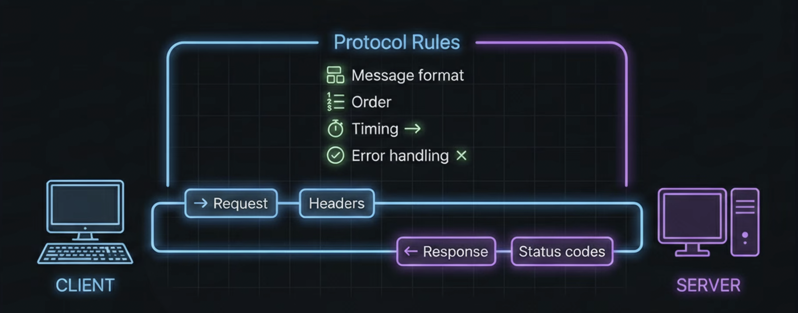
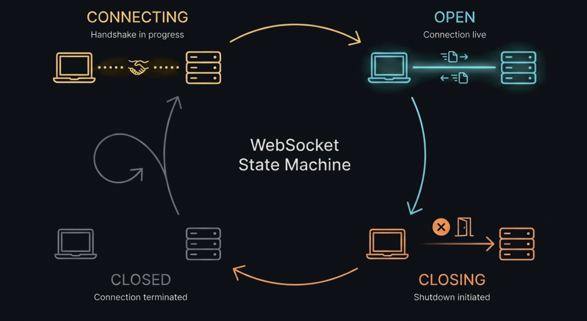
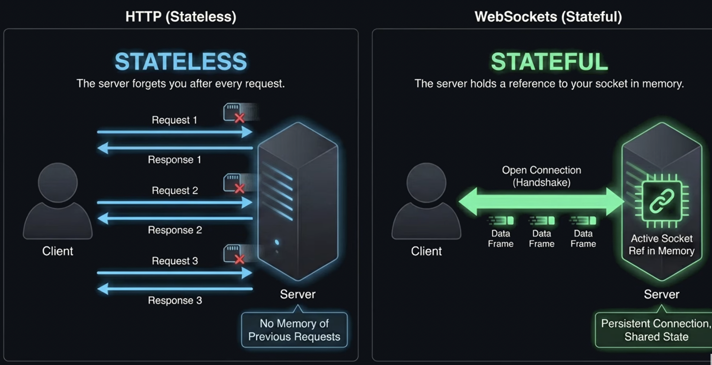
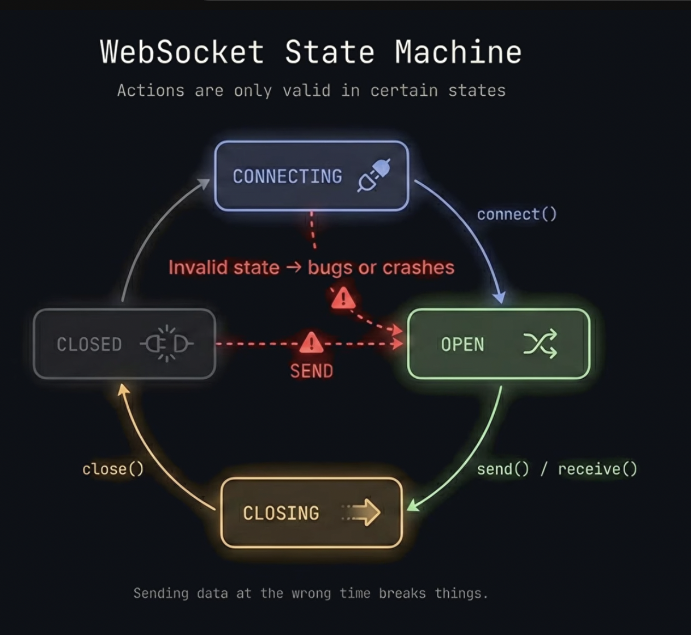
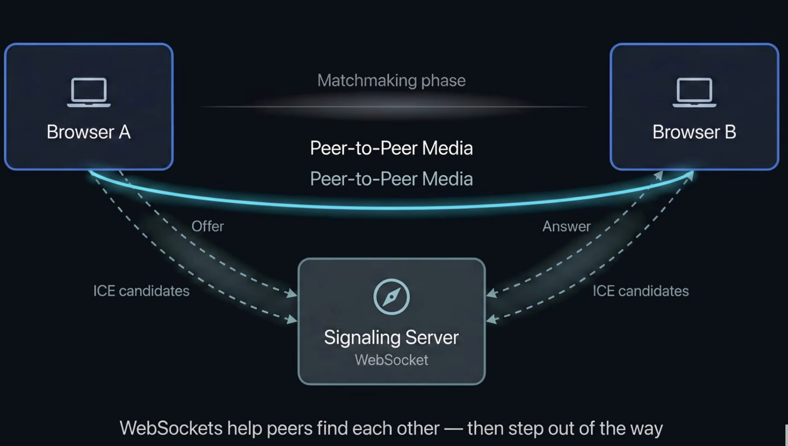
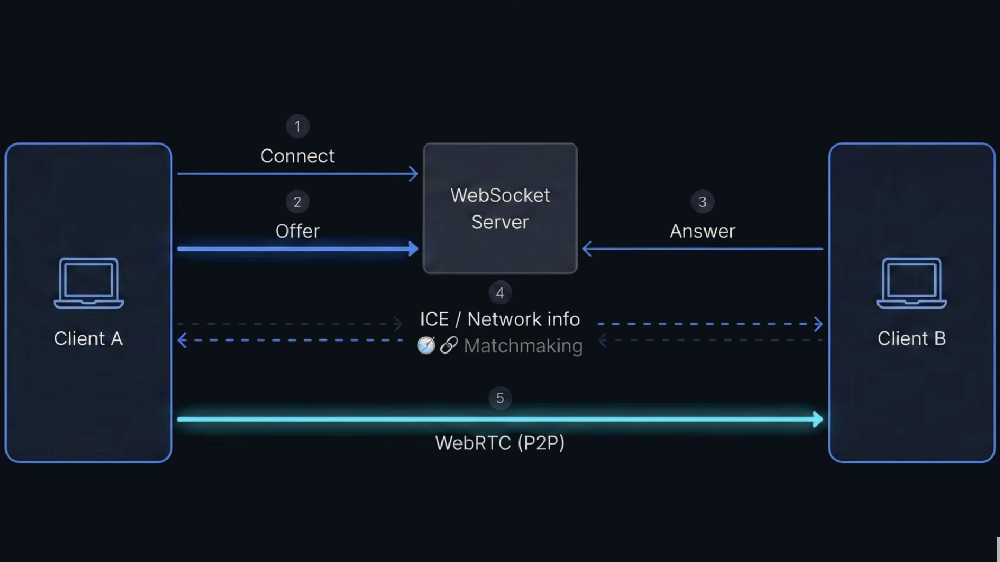
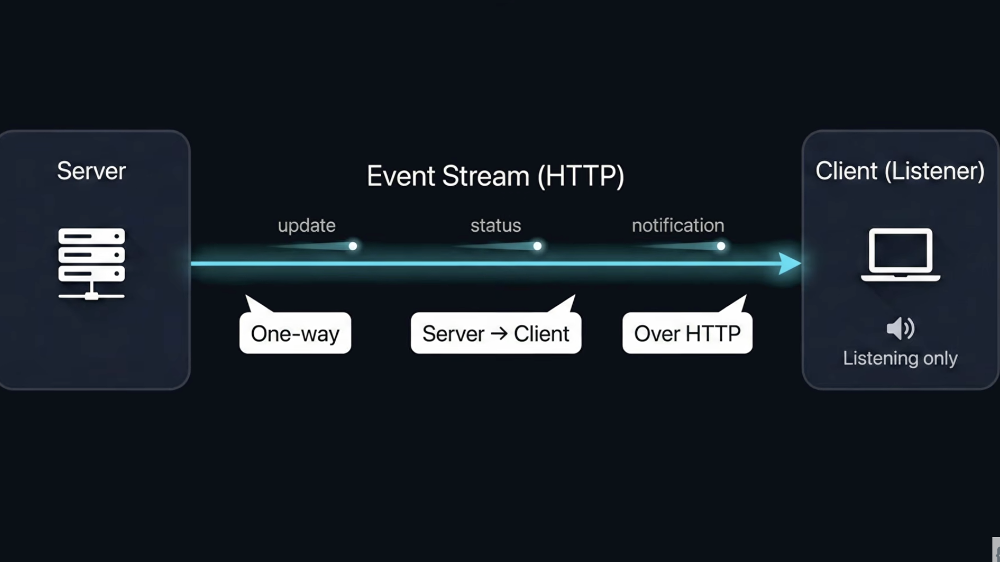
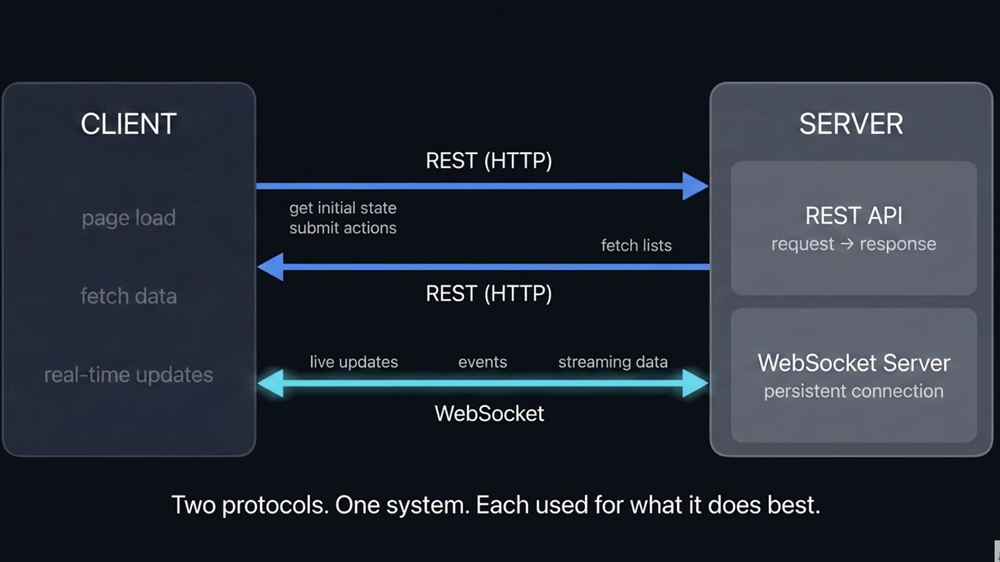

### WebSocket

`হলো এমন একটি টেকনোলজি যার মাধ্যমে একটি ওয়েব ব্রাউজার এবং একটি সার্ভারের মধ্যে সারাক্ষণ খোলা থাকে এমন একটি দ্বিমুখী (Two-way) যোগাযোগ পথ তৈরি হয়।`

**WebSocket-এর মূল বৈশিষ্ট্যসমূহ**

1. বিরামহীন সংযোগ (Persistent Connection): একবার কানেকশন তৈরি হয়ে গেলে সেটি বন্ধ হয় না (যতক্ষণ না কেউ নিজে থেকে বন্ধ করে)। ফলে প্রতিবার নতুন করে রিকোয়েস্ট পাঠানোর প্রয়োজন পড়ে না।

2. দ্বিমুখী যোগাযোগ (Full-Duplex): ক্লায়েন্ট এবং সার্ভার—উভয়ই যেকোনো সময় একে অপরকে ডাটা পাঠাতে পারে। সার্ভারকে আর ক্লায়েন্টের রিকোয়েস্টের জন্য অপেক্ষা করতে হয় না।

3. খুবই দ্রুত (Low Latency): যেহেতু কানেকশন আগে থেকেই তৈরি থাকে, তাই ডাটা আদান-প্রদানে একদমই সময় লাগে না। এটি রিয়েল-টাইম কাজের জন্য আদর্শ।

**এটি কীভাবে কাজ করে? (The Handshake)**

1. WebSocket শুরু হয় একটি সাধারণ HTTP রিকোয়েস্টের মাধ্যমে, কিন্তু এটি দ্রুত নিজেকে বদলে ফেলে। প্রক্রিয়াটি অনেকটা এরকম:

2. Handshake: ব্রাউজার সার্ভারকে একটি বিশেষ HTTP রিকোয়েস্ট পাঠায় এবং বলে— "ভাই, আমি কি প্রোটোকলটা বদলে WebSocket করতে পারি?" (একে বলা হয় Upgrade হেডার)।

3. Switching: সার্ভার যদি রাজি থাকে, তবে সে একটি 101 Switching Protocols রেসপন্স পাঠায়।

4. Open Connection: ব্যস! এখন আর HTTP নেই। এখন তাদের মধ্যে একটি সরাসরি পাইপলাইনের মতো কানেকশন তৈরি হয়ে গেল। এখন তারা ইচ্ছেমতো ডাটা চালাচালি করতে পারবে।

**WebSocket কেন ব্যবহার করবেন? (Real-life Use Cases)**
আপনি যখন নিচের অ্যাপ্লিকেশনগুলো ব্যবহার করেন, তখন পর্দার আড়ালে প্রায়ই WebSocket কাজ করে:

- Chat Applications: যেমন WhatsApp Web বা Messenger। আপনি টাইপ করার সাথে সাথেই অন্যজন দেখতে পায়।

- Live Sports Score: খেলা চলাকালীন পেজ রিফ্রেশ না করেই যে স্কোর আপডেট হয়।

- Stock/Crypto Market: সেকেন্ডে সেকেন্ডে দামের ওঠা-নামা দেখার জন্য।

- Multiplayer Games: গেমে যখন আপনি মুভ করেন এবং অন্য প্লেয়ার সাথে সাথে তা দেখতে পায়।

---

### Polling কী? (The Traditional Way)

`সহজ ভাষায়, Polling হলো ক্লায়েন্ট (যেমন আপনার ব্রাউজার) বারবার সার্ভারকে গিয়ে জিজ্ঞেস করা— "নতুন কোনো মেসেজ আছে? নতুন কোনো ডাটা আছে?`

### Polling-এর প্রকারভেদ

পোলিং মূলত দুই ধরণের হয়ে থাকে:

1.  Short Polling
    ব্রাউজার একটা নির্দিষ্ট সময় পর পর (যেমন প্রতি ২ সেকেন্ডে) সার্ভারকে রিকোয়েস্ট পাঠায়।

সমস্যা: সার্ভারে ডাটা না থাকলেও রিকোয়েস্ট যাচ্ছে, যা ব্যান্ডউইথ এবং সার্ভারের রিসোর্স নষ্ট করে।

2. Long Polling
   এটি একটু স্মার্ট। ব্রাউজার রিকোয়েস্ট পাঠায়, কিন্তু সার্ভার সাথে সাথে উত্তর দেয় না। সার্ভার রিকোয়েস্টটা ধরে রাখে যতক্ষণ না নতুন কোনো ডাটা আসে। ডাটা আসার সাথে সাথে সার্ভার রেসপন্স পাঠায় এবং কানেকশন ক্লোজ করে দেয়। এরপর ব্রাউজার আবার নতুন রিকোয়েস্ট পাঠায়।

সমস্যা: এটি শর্ট পোলিংয়ের চেয়ে ভালো হলেও প্রতিবার নতুন করে কানেকশন তৈরি করতে হয়, যা বেশ ব্যয়বহুল।

---

### HTTP এবং HTTPS কী?

`এগুলো হলো ইন্টারনেটে কথা বলার ভাষা বা নিয়ম (Protocol)।`

1. HTTP (HyperText Transfer Protocol): এটি হলো ক্লায়েন্ট (আপনার ব্রাউজার) এবং সার্ভারের মধ্যে ডাটা আদান-প্রদানের মূল নিয়ম। তবে এটি "Plain Text"-এ ডাটা পাঠায়। মাঝপথে কেউ চাইলে আপনার ডাটা চুরি করে পড়ে ফেলতে পারে।

2. HTTPS (HyperText Transfer Protocol Secure): এটি HTTP-এর একটি নিরাপদ সংস্করণ। এখানে SSL/TLS নামক একটি সিকিউরিটি লেয়ার থাকে যা আপনার ডাটাকে এনক্রিপ্ট (Lock) করে দেয়। ফলে হ্যাকাররা ডাটা পেলেও তা পড়তে পারে না।

### Header (হেডার) কী এবং এটি কী করে?

`হেডার হলো রিকোয়েস্ট বা রেসপন্সের সাথে পাঠানো অতিরিক্ত তথ্য।`

মনে করো, তুমি কাউকে একটা পার্সেল পাঠাবে। পার্সেলের ভেতর যা আছে সেটা হলো Data, আর পার্সেলের গায়ে লাগানো লেবেল (যেখানে লেখা আছে কার কাছে যাবে, ওজন কত, ভেতরে কী ধরণের জিনিস আছে) হলো Header।

হেডারের কাজ:

1. Identity: ব্রাউজার কোন ভার্সন ব্যবহার করছে তা জানানো (User-Agent)।

2. Content Type: ডাটা কি ফরম্যাটে আছে (যেমন: JSON, HTML না কি Image) তা জানানো।

3. Authentication: ইউজার লগইন করা কি না তা যাচাই করার জন্য টোকেন পাঠানো।

4. WebSocket Upgrade: WebSocket শুরু করার জন্য ব্রাউজার এই হেডারের মাধ্যমেই বলে, "আমি কানেকশনটা আপগ্রেড করতে চাই"।

### ডাটা কীভাবে পাঠায়? (Request & Response Cycle)

`HTTP-তে ডাটা আদান-প্রদান হয় চারটি প্রধান পদ্ধতিতে (এগুলোকে Verbs বা Methods বলে):`

- GET: সার্ভার থেকে ডাটা আনার জন্য (যেমন: কোনো ওয়েবসাইট দেখা)।

- POST: সার্ভারে নতুন ডাটা পাঠানোর জন্য (যেমন: ফেসবুক স্ট্যাটাস দেওয়া বা লগইন করা)।

- PUT/PATCH: আগের কোনো ডাটা আপডেট করার জন্য।

- DELETE: কোনো ডাটা মুছে ফেলার জন্য।

### ডাটা পাঠানোর প্রক্রিয়া (ধাপে ধাপে)

`যখন তুমি ব্রাউজারে google.com লিখে এন্টার দাও, তখন পর্দার আড়ালে যা ঘটে:`

- Request Line: ব্রাউজার বলে— GET /index.html HTTP/1.1 (অর্থাৎ: আমি index ফাইলটা চাই)।

- Headers: ব্রাউজার কিছু অতিরিক্ত তথ্য দেয় (যেমন: "আমি ক্রোম ব্রাউজার ব্যবহার করছি", "আমি বাংলা ভাষা বুঝি")।

- Body (ঐচ্ছিক): যদি তুমি কোনো ফর্ম ফিলাপ করো (POST রিকোয়েস্ট), তবে সেই তথ্যগুলো এই বডিতে থাকে।

- Server Response: সার্ভার সব দেখে শুনে একটা Status Code পাঠায় (যেমন: 200 OK মানে সব ঠিক আছে, আর 404 Not Found মানে ফাইলটি নেই)।

### WebSocket-এর সাথে এর সম্পর্ক কী?

`WebSocket শুরু হওয়ার সময় একটি বিশেষ HTTP GET রিকোয়েস্ট পাঠায় যেটার হেডারে লেখা থাকে:`

- Upgrade: websocket

- Connection: Upgrade

সার্ভার যদি এটা গ্রহণ করে, তবে সে `101 Switching Protocols` রেসপন্স দেয়। এরপর আর কোনো HTTP রিকোয়েস্ট-রেসপন্স চলে না, সরাসরি ডাটা আদান-প্রদান শুরু হয়।

---

### HTTPS-এর 'S' (SSL/TLS) কী?

`HTTPS মানে হলো Hypertext Transfer Protocol Secure। এই 'S' আসে SSL (Secure Sockets Layer) অথবা তার আধুনিক সংস্করণ TLS (Transport Layer Security) থেকে।`

সহজ কথায়, SSL/TLS হলো একটা ডিজিটাল তালা (Encryption)।

- HTTP-তে: ডাটা একদম খোলামেলা যায় (Plain Text)। মাঝপথে কেউ (যেমন হ্যাকার বা একই ওয়াইফাইয়ের অন্য কেউ) চাইলে আপনার পাসওয়ার্ড বা ক্রেডিট কার্ড নম্বর পড়ে ফেলতে পারে।

- HTTPS-এ: ডাটা পাঠানোর আগে সেটাকে হিজিবিজি কোডে লক করে দেওয়া হয়। শুধু আপনার ব্রাউজার আর সার্ভারের কাছেই সেই তালা খোলার চাবি থাকে।

### কেন ব্যবহার করা লাগে?

`এর প্রধান কাজ ৩টি:`

- Encryption (এনক্রিপশন): ডাটা লুকিয়ে ফেলা যাতে কেউ পড়তে না পারে।

- Data Integrity (ইনটেগ্রিটি): ডাটা যেন মাঝপথে কেউ বদলে দিতে না পারে।

- Authentication (অথেন্টিকেশন): আপনি আসলেই সঠিক সার্ভারের সাথে কথা বলছেন কি না তা নিশ্চিত করা। (যেমন: আপনি facebook.com এ ঢুকেছেন নাকি ফেইসবুকের মতো দেখতে অন্য কোনো ভুয়া সাইটে)।

### এই SSL/TLS সার্টিফিকেট আসে কই থেকে?

`সার্ভার মালিককে একটি CA (Certificate Authority)-র কাছ থেকে সার্টিফিকেট কিনতে হয় বা নিতে হয়।`

- CA হলো বিশ্বাসযোগ্য কিছু প্রতিষ্ঠান (যেমন: Let's Encrypt, DigiCert)।

- সার্ভার যখন তার আইডেন্টিটি প্রুফ করে, তখন CA তাকে একটি ডিজিটাল সার্টিফিকেট দেয়। ব্রাউজার এই সার্টিফিকেট দেখে নিশ্চিত হয় যে সাইটটি নিরাপদ।

### HTTP থেকে HTTPS-এ আপগ্রেড হয় কীভাবে?

`সার্ভার সাইডে এর কনফিগারেশন করা হয়। সাধারণত ৩টি ধাপে এটি ঘটে:`

- সার্টিফিকেট ইন্সটলেশন: সার্ভারে SSL সার্টিফিকেট বসানো হয়।

- Redirect: কেউ যদি ভুল করে http:// দিয়ে আপনার সাইটে ঢোকে, সার্ভার তাকে সাথে সাথে https:// লিংকে পাঠিয়ে দেয় (এটাকে বলে ৩০১ রিডাইরেক্ট)।

- HSTS: এটি ব্রাউজারকে বলে দেয় যে, "ভবিষ্যতে এই সাইটে কখনোই আনসিকিউরডভাবে ঢুকবে না।"

### নেটওয়ার্কিংয়ের সাথে এর কানেকশন কী?

`নেটওয়ার্কিংয়ের ভাষায় বললে, আমাদের OSI Model বুঝতে হবে।`

- HTTP/HTTPS থাকে Application Layer-এ।

- TCP থাকে Transport Layer-এ।

- স্বাভাবিকভাবে ডাটা আদান-প্রদান এভাবে হয়: `HTTP -> TCP -> IP`

- কিন্তু HTTPS-এর ক্ষেত্রে মাঝখানে একটি লেয়ার যোগ হয়: `HTTP -> SSL/TLS -> TCP -> IP`

---

### Handshake

`"Handshake" শব্দটা শুনলেই আমাদের চোখের সামনে দুজন মানুষের হাত মেলানোর দৃশ্য ভেসে ওঠে। নেটওয়ার্কিংয়ের ক্ষেত্রেও এর অর্থ অনেকটা একই—দুটো ডিভাইস (ব্রাউজার এবং সার্ভার) একে অপরের সাথে কথা বলা শুরু করার আগে কিছু শর্ত এবং নিয়ম ঠিক করে নেয়।`

### TLS Handshake কী এবং কেন দরকার?

`যখন আমরা বলি "Handshake হচ্ছে", তখন আসলে ব্রাউজার এবং সার্ভার তিনটি প্রধান কাজ নিশ্চিত করে:`

- Cipher Suite নির্ধারণ: তারা কোন ভাষায় (Encryption Algorithm) কথা বলবে তা ঠিক করে।

- Authentication: সার্ভার কি আসলেই আসল সার্ভার? (নাকি কোনো হ্যাকার ভুয়া ওয়েবসাইট খুলে বসে আছে?)

- Key Exchange: ডাটা লক করার জন্য একটি সিক্রেট চাবি তৈরি করা যা কেবল তারা দুজনই জানবে।

না করলে কী সমস্যা? যদি হ্যান্ডশেক না হতো, তবে আপনার পাঠানো ডাটা (যেমন পাসওয়ার্ড) ইন্টারনেটের তারের মধ্য দিয়ে যাওয়ার সময় যে কেউ "Packet Sniffing" করে দেখে ফেলতে পারতো। হ্যান্ডশেক ডাটাকে অদৃশ্য বা হিজিবিজি করে দেয়।

### হ্যান্ডশেকের ধাপগুলো (Step-by-Step Process)

এই পুরো প্রসেসটি মিলিসেকেন্ডের মধ্যে ঘটে। এখানে দেখলে তোমার বুঝতে সুবিধা হবে। ধাপগুলো নিচে দেওয়া হলো:

- Client Hello: ব্রাউজার সার্ভারকে বলে, "হ্যালো! আমি TLS ব্যবহার করতে চাই। আমার কাছে এই এই এনক্রিপশন অ্যালগরিদমগুলো আছে।"

- Server Hello: সার্ভার উত্তর দেয়, "ঠিক আছে, চলো আমরা এই অ্যালগরিদমটি ব্যবহার করি।" সাথে সার্ভার তার SSL Certificate এবং Public Key পাঠায়।

- Authentication: ব্রাউজার ওই সার্টিফিকেটটি চেক করে দেখে সেটি কোনো বিশ্বস্ত প্রতিষ্ঠান (CA) থেকে ইস্যু করা কি না। যদি ঠিক থাকে, ব্রাউজার নিশ্চিত হয় যে সে সঠিক সার্ভারে আছে।

- The Master Secret (Premaster Secret): ব্রাউজার একটি র‍্যান্ডম ডাটা স্ট্রিং তৈরি করে এবং সার্ভারের দেওয়া Public Key দিয়ে সেটি লক করে সার্ভারের কাছে পাঠায়।

- Private Key Decryption: সার্ভার তার নিজের কাছে থাকা Private Key দিয়ে ওই লক করা ডাটাটি খোলে। (মনে রাখবে, পাবলিক কি দিয়ে লক করা জিনিস কেবল প্রাইভেট কি দিয়েই খোলা যায়)।

- Session Keys Generated: এখন ব্রাউজার এবং সার্ভার—উভয়ের কাছেই ওই গোপন ডাটাটি আছে। তারা দুজনেই সেই ডাটা ব্যবহার করে একটি "Session Key" তৈরি করে।

- Finished: দুই পক্ষই একে অপরকে সিগন্যাল দেয় যে, "এখন থেকে আমরা এই চাবি দিয়ে সব ডাটা এনক্রিপ্ট করবো।"

### এসিম্যাট্রিক বনাম সিমেট্রিক এনক্রিপশন (মূল নেটওয়ার্কিং রহস্য)

`হ্যান্ডশেকের সময় দুই ধরণের এনক্রিপশন কাজ করে:`

- Asymmetric Encryption (শুরুতে): পাবলিক এবং প্রাইভেট কী ব্যবহার করে। এটি খুব শক্তিশালী কিন্তু প্রসেস করতে সময় বেশি লাগে। এটি শুধু চাবি আদান-প্রদানের জন্য ব্যবহৃত হয়।

- Symmetric Encryption (পরে): একবার যখন দুই পক্ষই একটি কমন চাবি (Session Key) পেয়ে যায়, তখন তারা এই পদ্ধতিতে ডাটা পাঠায়। এটি অনেক দ্রুত কাজ করে।

### হ্যান্ডশেক না হলে কী হতো? (The Danger)

`যদি হ্যান্ডশেক বা TLS না থাকতো, তবে নিচের অ্যাটাকগুলো খুব সহজে হতো:`

- Man-in-the-Middle (MITM) Attack: আপনার এবং সার্ভারের মাঝখানে কেউ বসে সব তথ্য চুরি করে নিত।

- Data Tampering: আপনি হয়তো পাঠিয়েছেন "বিকাশে ৫০০ টাকা পাঠান", হ্যাকার সেটা মাঝপথে বদলে করে দিল "৫০০০ টাকা পাঠান"। TLS থাকলে এটা অসম্ভব, কারণ ডাটা বদলালে তার 'তালা' আর খুলবে না।

`WebSocket-এর ক্ষেত্রেও ঠিক একইভাবে প্রথমে একটি HTTP/HTTPS হ্যান্ডশেক হয়, তারপর সেটি WebSocket Connection-এ বদলে যায়।`

---

### ব্রাউজারের কাছে আগে থেকে কী থাকে?

`তুমি যখন ক্রোম বা ফায়ারফক্স ইন্সটল করো, তখন তার ভেতরে অনেকগুলো Cipher Suites (অ্যালগরিদমের সেট) আগে থেকেই দেওয়া থাকে।`

### Cipher Suite-এ মূলত ৪টি জিনিস থাকে:

- Key Exchange Algorithm: চাবি কীভাবে আদান-প্রদান হবে (যেমন: ECDHE)।

- Authentication Algorithm: সার্ভারকে কীভাবে চিনবে (যেমন: RSA)।

- Bulk Encryption Algorithm: মূল ডাটা কোন নিয়মে লক হবে (যেমন: AES)।

- Hashing Algorithm: ডাটা ঠিক আছে কি না তা চেক করার নিয়ম (যেমন: SHA256)।

`ব্রাউজার যখন বলে "Hello", সে আসলে তার কাছে থাকা এই লিস্টটা সার্ভারকে পাঠিয়ে দেয়। সার্ভার সেই লিস্ট থেকে যেটা তার কাছে সবচেয়ে শক্তিশালী মনে হয়, সেটা বেছে নেয়।`

### TLS আসলে কী? (The Invisible Guard)

`TLS (Transport Layer Security) হলো SSL-এর আধুনিক এবং অনেক বেশি শক্তিশালী ভার্সন। এটি কোনো অ্যাপ বা সফটওয়্যার না, এটি একটি প্রোটোকল বা নিয়ম।`

এর কাজ হলো ইন্টারনেটে ডাটা চলাচলের জন্য একটি এনক্রিপ্টেড টানেল (Tunnel) তৈরি করা।

- কেন দরকার? ধরো তুমি একটা পাইপের ভেতর দিয়ে টাকা পাঠাচ্ছ। পাইপটা যদি স্বচ্ছ কাঁচের হয়, সবাই দেখবে কত টাকা যাচ্ছে (HTTP)। কিন্তু TLS ওই পাইপটাকে এমন একটা প্রলেপ দিয়ে ঢেকে দেয় যে কেউ আর ভেতরটা দেখতে পায় না (HTTPS)।

### পাবলিক কী (Public Key) এবং প্রাইভেট কী (Private Key) -র রহস্য

`এখানেই নেটওয়ার্কিংয়ের সবচেয়ে ইন্টারেস্টিং পার্ট। এটাকে বলে Asymmetric Encryption।`

কল্পনা করো একটা বিশেষ ধরণের তালা এবং চাবি:

- Public Key (তালা): এই তালাটা সার্ভার সবাইকে বিলিয়ে দেয়। যে কেউ এই তালা দিয়ে কোনো বাক্স আটকাতে পারে। কিন্তু, একবার আটকে দিলে সে নিজেও আর খুলতে পারবে না।

- Private Key (চাবি): এই চাবিটা শুধু সার্ভারের কাছেই থাকে। সারা দুনিয়ার যে কেউ ওই 'পাবলিক তালা' দিয়ে কোনো কিছু লক করে পাঠালে, সেটা শুধুমাত্র এই 'প্রাইভেট চাবি' দিয়েই খোলা সম্ভব।

### হ্যান্ডশেকের সেই মুহূর্ত (The "Secret" Exchange)

`"ক্লায়েন্ট একটা গোপন চাবি (Session Key) তৈরি করে পাঠায়"—সেখানে একটা সূক্ষ্ম ব্যাপার আছে:`

- ব্রাউজার একটা র‍্যান্ডম ডাটা তৈরি করে (যাকে বলে Pre-master Secret)।

- ব্রাউজার সার্ভারের পাঠানো Public Key (তালা) দিয়ে ওই র‍্যান্ডম ডাটাকে লক করে দেয়।

- এখন ওই লক করা ডাটাটা ইন্টারনেটের মাঝখান দিয়ে সার্ভারের কাছে যায়। মাঝপথে কেউ সেটা চুরি করলেও লাভ নেই, কারণ চাবি (Private Key) তো শুধু সার্ভারের কাছে!

- সার্ভার তার নিজের চাবি দিয়ে ওটা খোলে।

ফলাফল: এখন ব্রাউজার আর সার্ভার—দুজনের কাছেই একটা গোপন "র‍্যান্ডম ডাটা" চলে এলো। এই ডাটা থেকেই তৈরি হয় Session Key। এরপর থেকে আর পাবলিক-প্রাইভেট কি লাগে না, এই একটা চাবি দিয়েই তালা খোলা আর লাগানো হয় (Symmetric Encryption)।

### যদি হ্যান্ডশেক না হতো? (The Security Gap)

যদি এই প্রসেস না থাকতো:

- Phishing: তুমি ঢুকতে চাইতে mybank.com এ, কিন্তু হ্যাকার তোমাকে নিয়ে যেত mybaank.com এ। হ্যান্ডশেক না থাকলে ব্রাউজার বুঝতে পারতো না যে সার্টিফিকেট ভুয়া।

- Eavesdropping: তোমার ওয়াইফাই রাউটারের মালিক বা আইএসপি (ISP) সহজেই দেখে ফেলতো তুমি চ্যাটে কার সাথে কী কথা বলছো।

### HTTP Status Codes

1. ১০০ - ১৯৯: Information (তথ্যমূলক)
   সার্ভার বলছে: "তোমার রিকোয়েস্ট পেয়েছি, কাজ চলছে।" \* 101 Switching Protocols: এটা WebSocket-এর জন্য সবচেয়ে গুরুত্বপূর্ণ। যখন ব্রাউজার বলে আমি WebSocket হতে চাই, সার্ভার রাজি হলে এই ১০১ কোডটা দেয়।

2. ২০০ - ২৯৯: Success (সফলতা)
   `সার্ভার বলছে: "সব ঠিক আছে! কাজ হয়ে গেছে।"`

- 200 OK: সবচেয়ে কমন। তুমি পেজ রিকোয়েস্ট করেছো এবং সার্ভার সেটা ঠিকঠাক পাঠিয়েছে।

- 201 Created: যখন তুমি নতুন কিছু তৈরি করো (যেমন: সাইন-আপ করা বা নতুন পোস্ট দেওয়া)।

3. ৩০০ - ৩৯৯: Redirection (রাস্তা পরিবর্তন)
   `সার্ভার বলছে: "তুমি যেটা খুঁজছো সেটা এখানে নেই, অন্য ঠিকানায় যাও।"`

- 301 Moved Permanently: যখন কোনো ওয়েবসাইট স্থায়ীভাবে অন্য ডোমেইনে চলে যায়।

- 302 Found: সাময়িকভাবে অন্য কোনো পেজে পাঠাতে হলে।

4. ৪০০ - ৪৯৯: Client Error (তোমার ভুল)
   `সার্ভার বলছে: "তুমি ভুল কিছু পাঠিয়েছো, আমি এটা করতে পারবো না।"`

- 400 Bad Request: সার্ভার তোমার রিকোয়েস্ট বুঝতে পারছে না (হয়তো বানানে ভুল বা ডাটা ভুল)।

- 401 Unauthorized: তুমি লগইন না করে এমন কিছু দেখতে চাইছো যা দেখার অনুমতি নেই।

- 403 Forbidden: তুমি লগইন থাকলেও এই ফাইলটা দেখার পারমিশন তোমার নেই।

- 404 Not Found: সবচেয়ে ফেমাস! তুমি এমন একটা লিংকে গেছো যা সার্ভারে অস্তিত্বই নেই।

5. ৫০০ - ৫৯৯: Server Error (সার্ভারের ভুল)
   `সার্ভার বলছে: "সরি ভাই! আমার নিজের সিস্টেমে কোনো গণ্ডগোল হয়েছে।"`

- 500 Internal Server Error: সার্ভারের কোডিংয়ে কোনো ভুল হয়েছে বা সার্ভার ক্রাশ করেছে।

- 503 Service Unavailable: সার্ভার হয়তো ওভারলোডেড বা মেইনটেন্যান্স চলছে।

---

### ws:// বনাম wss:// (The Difference)

`যেমন HTTP এবং HTTPS আছে, ঠিক তেমনি WebSocket-এরও দুটি ভার্সন আছে:`

- ws:// (WebSocket): এটি হলো সাধারণ বা আনসিকিউরড ভার্সন। এটি পোর্ট 80 ব্যবহার করে। এখানে ডাটা এনক্রিপ্ট হয় না, অর্থাৎ মাঝপথে কেউ চাইলে ডাটা পড়ে ফেলতে পারে।

- wss:// (WebSocket Secure): এটি হলো সিকিউরড ভার্সন (WebSocket over TLS/SSL)। এটি পোর্ট 443 ব্যবহার করে। এখানে ডাটা এনক্রিপ্ট হয়ে যায়, যা অনেক বেশি নিরাপদ।

`প্রো টিপ: রিয়েল অ্যাপ্লিকেশনে সব সময় wss:// ব্যবহার করা উচিত, কারণ এটি প্রক্সি এবং ফায়ারওয়াল খুব সহজে পার করতে পারে।`

### WebSocket Architecture (কীভাবে কাজ করে?)

`WebSocket আর্কিটেকচার মূলত তিনটি ধাপে কাজ করে:`

1. হ্যান্ডশেক (Handshake)
   ক্লায়েন্ট (ব্রাউজার) একটি HTTP রিকোয়েস্ট পাঠায় সার্ভারের কাছে। এই রিকোয়েস্টে দুটি বিশেষ হেডার থাকে:

Upgrade: websocket

Connection: Upgrade

2. বাইডাইরেকশনাল কানেকশন (Bidirectional)
   সার্ভার যদি রাজি হয়, তবে সে 101 Switching Protocols রেসপন্স দেয়। এখন HTTP পাইপলাইনটি একটি WebSocket পাইপলাইনে পরিণত হয়। এখন ক্লায়েন্ট এবং সার্ভার দুজনেই ডাটা পাঠাতে পারে।

3. ডাটা ফ্রেম (Data Frames)
   HTTP-তে যেমন বড় বড় মেসেজ পাঠানো হয়, WebSocket-এ ডাটা ছোট ছোট "Frames" আকারে পাঠানো হয়। এতে ব্যান্ডউইথ কম খরচ হয়।

### Ghost Connection (জম্বি কানেকশন) কী?

`এটি WebSocket-এর একটি অদ্ভুত এবং বিরক্তিকর সমস্যা।`

`Ghost Connection` হলো এমন একটি অবস্থা যেখানে:

- সার্ভার মনে করছে ক্লায়েন্ট কানেক্টেড আছে।

- কিন্তু বাস্তবে ক্লায়েন্টের ইন্টারনেট চলে গেছে বা ব্রাউজার ক্রাশ করেছে।

কেন হয়? WebSocket একটি সারাক্ষণ খোলা থাকা কানেকশন। যদি কোনো কারণে ক্লায়েন্ট প্রপারলি "Close" মেসেজ না পাঠিয়েই ডিসকানেক্ট হয়ে যায় (যেমন: হঠাৎ ওয়াইফাই বন্ধ হয়ে গেলে), সার্ভার অনেক সময় বুঝতে পারে না যে ওই ইউজার আর নেই। ফলে সার্ভারের রিসোর্স নষ্ট হতে থাকে।

এটি কীভাবে সমাধান করা হয়? `(Heartbeat/Ping-Pong)
সার্ভার আর ক্লায়েন্টের মধ্যে একটি "হার্টবিট" মেকানিজম রাখা হয়:`

- সার্ভার প্রতি ৩০ সেকেন্ড পর পর ক্লায়েন্টকে একটি ছোট মেসেজ পাঠায় (যাকে বলে Ping)।

- ক্লায়েন্ট যদি বেঁচে থাকে, তবে সে সাথে সাথে উত্তর দেয় (Pong)।

- যদি সার্ভার কয়েকবার Ping পাঠিয়েও কোনো Pong না পায়, তবে সে বুঝে নেয় এটা একটা Ghost Connection এবং সে কানেকশনটি নিজে থেকে বন্ধ করে দেয়।

4. কেন WebSocket আর্কিটেকচার সেরা?

- Low Latency প্রতিবার রিকোয়েস্ট তৈরি করতে হয় না বলে দেরি হয় না।

- Lightweight একবার হ্যান্ডশেক হয়ে গেলে পরবর্তী ডাটার সাথে বড় বড় হেডার যায় না।

- Full-Duplex একই সাথে রিসিভ এবং সেন্ড করা যায়।

---

### Buffer (বাফার) কী?

`সহজ কথায়, Buffer হলো মেমোরির একটি নির্দিষ্ট জায়গা যেখানে সাময়িকভাবে কিছু ডাটা রাখা হয়।`

`বাস্তব উদাহরণ:` ইউটিউবে যখন ভিডিও দেখো, তখন দেখবে ভিডিওর লাল দাগের আগে একটা হালকা ধূসর (gray) রঙের দাগ এগিয়ে যায়। ওটাই হলো Buffering। তার মানে হলো, তোমার ইন্টারনেট থেকে ভিডিওর ডাটাগুলো এসে আগে মেমোরির একটা 'বালতি' বা 'Buffer'-এ জমা হচ্ছে, তারপর সেখান থেকে প্লেয়ার ভিডিওটি দেখাচ্ছে।

- Node.js-এ: বাফার মূলত বাইনারি ডাটা (Binary Data) নিয়ে কাজ করার জন্য ব্যবহৃত হয়। এটি মেমোরির বাইরে একটি র-ডাটা (Raw data) চাঙ্ক।

### ArrayBuffer কী?

`ArrayBuffer হলো ব্রাউজারের (Client-side) কনসেপ্ট। এটি মেমোরির একটি নির্দিষ্ট অংশ যেখানে বাইনারি ডাটা জমা থাকে।`

তবে একটা টুইস্ট আছে: তুমি ArrayBuffer সরাসরি পড়তে বা এডিট করতে পারবে না। এটা শুধু একটা মেমোরি ব্লক। এই ডাটা দেখার জন্য তোমার একটা চশমা লাগবে, যাকে বলা হয় `View (যেমন: Uint8Array, Float32Array)।`

- ArrayBuffer: আসল ডাটা যেখানে থাকে।

- TypedArray (View): যেখান থেকে তুমি ডাটাগুলো পড়ো (যেমন: ৮ বিট করে বা ১৬ বিট করে)।

### ডাটা আসলে কীভাবে যায়? (The Transfer Process)

`যখন তুমি WebSocket বা নেটওয়ার্ক দিয়ে ডাটা পাঠাও, তখন ডাটা আসলে Electrical Signal বা Light Pulse হিসেবে যায়। প্রক্রিয়াটি এরকম:`

- Serialization: তুমি যদি একটা অবজেক্ট পাঠাও {name: "Gemini"}, ব্রাউজার সেটাকে প্রথমে স্ট্রিং বা বাইনারিতে কনভার্ট করে।

- Binary Conversion: সেই স্ট্রিং বা ইমেজকে Buffer/ArrayBuffer-এ রূপান্তর করা হয় (অর্থাৎ ০ আর ১ এর গুচ্ছ)।

- Packets: এই বড় বাফারকে ছোট ছোট টুকরো বা Packets-এ ভাগ করা হয়।

- The Wire: এই প্যাকেটগুলো তারের ভেতর দিয়ে ভোল্টেজ হিসেবে বা ফাইবারের ভেতর দিয়ে আলো হিসেবে অন্য পাশে যায়।

- Re-assembly: সার্ভার সেই প্যাকেটগুলো পেয়ে আবার জোড়া লাগিয়ে বাফারে জমা করে।

- Deserialization: সার্ভার বাফার থেকে ডাটা পড়ে আবার অরিজিনাল ফর্মে নিয়ে আসে।

### JSON বনাম Buffer: কোনটা কখন?

- JSON: যখন ছোটখাটো টেক্সট ডাটা পাঠাতে হয় (যেমন: চ্যাট মেসেজ, ইউজার প্রোফাইল)। এটা মানুষের জন্য পড়া সহজ কিন্তু সাইজে বড় হয়।

- Buffer/Binary: যখন বড় ডাটা বা দ্রুত ডাটা দরকার (যেমন: ইমেজ, অডিও, ভিডিও, বা গেমের লোকেশন)। এটা অনেক ফাস্ট এবং ব্যান্ডউইথ কম খরচ করে।

5. WebSocket-এ এটি কীভাবে কাজ করে?
   `WebSocket-এ তুমি যখন socket.send(data) করো, তখন তুমি দুইভাবে ডাটা পাঠাতে পারো:`

- socket.send("Hello") — এটি UTF-8 ফরম্যাটে টেক্সট হিসেবে যাবে।

- socket.send(myArrayBuffer) — এটি Binary Frame হিসেবে যাবে।

`ডাটা হলো মালামাল, আর Buffer হলো সেই মালামাল রাখার গোডাউন। নেটওয়ার্ক দিয়ে যখন পাঠাতে হয়, তখন সেই মালামালকে ছোট ছোট বক্সে (Packets) ভরে তারের মধ্য দিয়ে পাঠানো হয়।`

---

### JSON নাকি Binary?

`WebSocket-এ ডাটা পাঠানোর সময় মূলত দুটি রাস্তা আছে:`

- Text Frames (JSON): যদি তুমি চ্যাট অ্যাপ বা সাধারণ ডাটা পাঠাতে চাও, তবে তুমি ডাটাকে JSON.stringify() করে টেক্সট হিসেবে পাঠাও। ব্রাউজার এবং সার্ভার এটাকে UTF-8 টেক্সট হিসেবে চিনে নেয়।

- Binary Frames (Buffer/ArrayBuffer): যদি তুমি ইমেজ, ফাইল বা খুব ফাস্ট কোনো গেমের ডাটা পাঠাতে চাও, তবে তুমি সেটাকে বাইনারি ফরম্যাটে পাঠাও।

`প্রশ্ন হলো—WebSocket কীভাবে বোঝে যে কোনটা টেক্সট আর কোনটা বাইনারি? এখানেই আসে Opcode।`

2. Opcode কী? (Operation Code)
   `WebSocket যখন ডাটা পাঠায়, সে ডাটাকে ছোট ছোট Frames-এ ভাগ করে। প্রতিটি ফ্রেমের শুরুতে একটা ছোট্ট অংশ থাকে যা বলে দেয় ওই ফ্রেমের ভেতর কী আছে এবং সেটা নিয়ে কী করতে হবে। এই অংশটিকেই বলে Opcode।`

এটি ৪-বিটের একটি সংখ্যা। সাধারণ কিছু Opcode হলো:

- 0x1 (Text Frame): যখন তুমি টেক্সট বা JSON পাঠাও।

- 0x2 (Binary Frame): যখন তুমি Buffer বা ArrayBuffer পাঠাও।

- 0x8 (Connection Close): যখন কানেকশন বন্ধ করার সিগন্যাল যায়।

- 0x9 (Ping): চেক করার জন্য যে অন্য পাশ বেঁচে আছে কি না।

- 0xA (Pong): পিং-এর উত্তর।

3. Opcode কেন এবং কখন ব্যবহার হয়?

`এটি মূলত নিচুতলার (Low-level) প্রোটোকল ম্যানেজমেন্টের জন্য ব্যবহৃত হয়।`

- কখন লাগে? যখন ব্রাউজার বা সার্ভার কোনো ডাটা পায়, সে সবার আগে Opcode দেখে। যদি দেখে Opcode 0x1, সে ওটাকে টেক্সট হিসেবে ডিকোড করার চেষ্টা করে। যদি দেখে 0x2, সে ওটাকে র-বাইনারি (Raw Binary) হিসেবে বাফারে জমা করে।

- কেন লাগে? HTTP-তে যেমন Content-Type হেডার দিয়ে বলা হতো এটা application/json নাকি image/png, WebSocket-এ তো বারবার হেডার পাঠানো হয় না (ব্যান্ডউইথ বাঁচানোর জন্য)। তাই এই ছোট Opcode দিয়েই কাজ চালানো হয়।

4. WebSocket-এর সাথে এর কানেকশন কী?

`WebSocket-এর পুরো আর্কিটেকচার দাঁড়িয়ে আছে এই Framing-এর ওপর।`

- তুমি যখন তোমার কোডে লেখো socket.send(myData), তখন ব্রাউজার পর্দার আড়ালে ডাটা টাইপ চেক করে।
- যদি দেখে ডাটাটা স্ট্রিং, সে ফ্রেমের ভেতরে Opcode 0x1 বসিয়ে দেয়।
- যদি দেখে ডাটাটা একটা Buffer বা Blob, সে ফ্রেমের ভেতরে Opcode 0x2 বসিয়ে দেয়।
- ডাটা যখন অন্য প্রান্তে পৌঁছায়, সার্ভার ওই Opcode দেখেই ডিসাইড করে সে এটাকে কীভাবে প্রসেস করবে।

5. সহজ উদাহরণ (Real-world Analogy)

`মনে করো, তুমি কুরিয়ার সার্ভিসে দুটো বক্স পাঠাবে।`

- একটার ওপর লিখলে "বই" (Opcode 0x1)। কুরিয়ারম্যান জানে এটা সাবধানে রাখতে হবে কিন্তু পানি লাগলে সমস্যা নেই।

- আরেকটার ওপর লিখলে "কাঁচের জিনিস" (Opcode 0x2)। সে জানে এটা খুব সাবধানে ধরতে হবে।

এখানে ওই ছোট লেখাটাই হলো Opcode, যা কুরিয়ারম্যানকে (সার্ভারকে) বলে দিচ্ছে ভেতরের জিনিসটা (Data) কী এবং ওটা নিয়ে কী করতে হবে।

---

## ArrayBuffer (আসল মেমোরি ব্লক)

`এটি হলো মেমোরির একটি ফিক্সড সাইজের ব্লক। এটা অনেকটা একটা খালি গুদামের মতো। এখানে শুধু বাইনারি ডাটা (০ আর ১) থাকে।`

- বৈশিষ্ট্য: আপনি সরাসরি ArrayBuffer-এর ভেতর কী আছে তা দেখতে পারবেন না বা এডিট করতে পারবেন না।

- কোথায় থাকে: এটি মূলত ব্রাউজারে (Client-side JavaScript) ব্যবহৃত হয়।

2. TypedArray (ডাটা পড়ার চশমা)

`যেহেতু আপনি ArrayBuffer সরাসরি পড়তে পারেন না, তাই আপনার একটা মাধ্যম দরকার। TypedArray হলো সেই মাধ্যম। এটি একটি ArrayBuffer-এর ওপর লেয়ার হিসেবে কাজ করে।`

মনে করুন, আপনার গুদামে অনেকগুলো ছোট ছোট বক্স আছে। এখন আপনি সেগুলো কীভাবে গুনবেন?

- Uint8Array: আপনি গুদামটিকে ৮-বিট (১ বাইট) করে ভাগ করে দেখছেন।

- Int32Array: আপনি গুদামটিকে ৩২-বিট (৪ বাইট) করে ভাগ করে দেখছেন।

3. Buffer (Node.js স্পেশাল)

`Buffer হলো মূলত Node.js-এর একটি ফিচার। ব্রাউজারে যেমন ArrayBuffer আছে, Node.js-এ ডাটা হ্যান্ডেল করার জন্য আছে Buffer।`

- পার্থক্য: Buffer নিজেই নিজের ডাটা পড়তে এবং লিখতে পারে। এর জন্য আলাদা কোনো "চশমা" বা TypedArray লাগে না।

- ব্যবহার: ফাইল পড়া, নেটওয়ার্ক থেকে ডাটা আসা (যেমন WebSocket-এর ফ্রেম) — এসব ক্ষেত্রে Node.js Buffer ব্যবহার করে।

---

### একটি উদাহরণের মাধ্যমে দেখা যাক

`ধরুন, আপনার কাছে ৮ বাইটের একটা ডাটা আছে।`

```js
// ১. একটা ৮ বাইটের খালি গুদাম তৈরি করলাম
let bufferStorage = new ArrayBuffer(8);

// ২. এখন এটা পড়ার জন্য ৮-বিটের চশমা পরলাম
let view = new Uint8Array(bufferStorage);

// ৩. ডাটা লিখলাম
view[0] = 255;
console.log(view); // [255, 0, 0, 0, 0, 0, 0, 0]
```

এখানে bufferStorage হলো গুদাম (ArrayBuffer), আর view হলো আপনার চশমা (TypedArray)। আর যদি আপনি Node.js-এ থাকতেন, তবে সরাসরি Buffer.from([255]) দিয়েই কাজ সেরে ফেলতে পারতেন।

### WebSocket-এর সাথে এদের কানেকশন কী?

`যখন WebSocket দিয়ে কোনো ইমেজ বা ফাইল আসে:`

- সেটি নেটওয়ার্ক থেকে Binary Data হিসেবে আসে।

- ব্রাউজার সেটাকে ArrayBuffer হিসেবে গ্রহণ করে।

- আপনি যদি সেই ইমেজের পিক্সেল এডিট করতে চান, তবে আপনি Uint8ClampedArray (এক ধরণের TypedArray) ব্যবহার করে সেই ডাটা প্রসেস করেন।

---

### Backpressure

`Backpressure হলো এমন একটি অবস্থা যখন ডাটা আসার গতি (Producer speed) ডাটা প্রসেস করার গতির (Consumer speed) চেয়ে অনেক বেশি হয়ে যায়।`

1. WebSocket-এ Backpressure কেন হয়?
   `WebSocket হলো একটি Continuous Stream। এখানে ডাটা আসতেই থাকে। সমস্যাটা তখন হয় যখন:`

- সার্ভার খুব দ্রুত ডাটা পাঠাচ্ছে (যেমন: প্রতি মিলিসেকেন্ডে লাইভ স্টক আপডেট)।

- কিন্তু ব্রাউজার (Client) সেই ডাটা নিয়ে গ্রাফ আঁকতে বা রেন্ডার করতে তার চেয়ে বেশি সময় নিচ্ছে।

যেহেতু WebSocket কানেকশনটি খোলা থাকে, তাই এই নাতি-প্রসেস হওয়া ডাটাগুলো মেমোরিতে (Buffer) জমা হতে থাকে। একটা সময় মেমোরি ফুল হয়ে ব্রাউজার বা অ্যাপ হ্যাং করে। এটাই হলো Backpressure সমস্যা।

2. এটি কী কাজ করে এবং কেন ব্যবহার করা হয়?
   `Backpressure-এর কাজ হলো ব্রেক কষানো। এটি নিশ্চিত করে যে:`

- সার্ভারকে থামানো: যদি ব্রাউজার দেখে তার বাফার ফুল হয়ে যাচ্ছে, সে সার্ভারকে সিগন্যাল দেয়— "একটু থামো, আমি আগের ডাটাগুলো প্রসেস করে নেই।"

- মেমোরি সেভ করা: সিস্টেম যেন মেমোরি শেষ হয়ে ক্রাশ না করে।

- ডাটা লস কমানো: অগোছালোভাবে ডাটা না হারিয়ে যেন সুশৃঙ্খলভাবে প্রসেস হয়।

3. Backpressure মূলত ৩টি বিষয়ের সাথে সরাসরি সম্পর্কিত:

- TCP Flow Control: WebSocket যেহেতু TCP-র ওপর কাজ করে, তাই নিচু লেভেলে TCP নিজেই উইন্ডো সাইজ (Window Size) ব্যবহার করে ডাটা কন্ট্রোল করে।

- Buffer Management: তোমার বাফারে (ArrayBuffer/Buffer) কতটুকু জায়গা ফাঁকা আছে তার ওপর ভিত্তি করে এটি কাজ করে।

- Reactive Streams: আধুনিক প্রোগ্রামিংয়ে (যেমন: RxJS বা Node.js Streams) ব্যাকপ্রেশার হ্যান্ডেল করার জন্য আলাদা মেকানিজম থাকে।

4. কীভাবে এটি সমাধান করা হয়?
   `ডেভেলপার হিসেবে আমরা সাধারণত এই ৩টি পদ্ধতি ব্যবহার করি:`

- Buffering: ডাটা সাময়িকভাবে একটি কিউতে (Queue) জমিয়ে রাখা।

- Dropping: যদি বাফার ভরে যায়, তবে নতুন আসা ডাটাগুলো ফেলে দেওয়া (যেমন: লাইভ ভিডিওর ক্ষেত্রে পুরনো ফ্রেম ফেলে দেওয়া হয়)।

- Throttling/Debouncing: সার্ভারকে বলা যেন সে ডাটা পাঠানোর ফ্রিকোয়েন্সি কমিয়ে দেয় (যেমন: প্রতি ১০ মিলিসেকেন্ডের বদলে প্রতি ১০০ মিলিসেকেন্ডে ডাটা পাঠানো)।









---

### Zombie বা Ghost Server

`নেটওয়ার্কিংয়ের ভাষায় "জম্বি" অবস্থা তৈরি হয় যখন প্রসেস বা কানেকশনটি তার কাজ শেষ করেছে, কিন্তু অপারেটিং সিস্টেম এখনো তাকে মেমোরি থেকে মুছে ফেলেনি।`

WebSocket-এ কেন হয়? যেহেতু WebSocket একটি Persistent (স্থায়ী) কানেকশন, তাই ক্লায়েন্ট যদি হুট করে পিসি বন্ধ করে দেয় বা ইন্টারনেট চলে যায়, সার্ভারের অপারেটিং সিস্টেম সাথে সাথে বুঝতে পারে না যে ওই ইউজার আর নেই।

- সমস্যা: সার্ভার মনে করে ইউজার এখনো আছে, তাই সে তার জন্য মেমোরি ধরে রাখে। এভাবে অনেক "জম্বি কানেকশন" জমা হলে তোমার নোড জেএস সার্ভার ক্রাশ করতে পারে।

- সমাধান: এজন্যই আমরা Ping-Pong (Heartbeat) মেকানিজম ব্যবহার করি। সার্ভার মাঝে মাঝে ধাক্কা দিয়ে দেখে ক্লায়েন্ট কি মরে গেছে নাকি বেঁচে আছে।

### Memory Leakage কেন হয়?

`WebSocket-এ মেমোরি লিক হওয়ার প্রধান কারণ হলো "Ghost/Zombie Connections"।`

- সমস্যা: ধরো, ১০০০ ইউজার কানেক্টেড ছিল। তাদের মধ্যে ৫০০ জন ওয়াইফাই বন্ধ করে দিলো বা ফোন অফ করে দিলো। তারা কিন্তু সার্ভারকে "Close" মেসেজ পাঠাতে পারেনি। সার্ভার মনে করে তারা এখনো আছে এবং তাদের জন্য RAM-এ জায়গা ধরে রাখে। এভাবে দিন শেষে হাজার হাজার কানেকশন জমে গিয়ে সার্ভার ক্রাশ করে।

- সমাধান: Heartbeat (Ping-Pong) মেকানিজম। সার্ভার প্রতি ৩০ সেকেন্ড পরপর সবাইকে একটা 'Ping' পাঠাবে। যারা উত্তর দেবে না, সার্ভার তাদের মেমোরি থেকে মুছে কানেকশন ডিসকানেক্ট করে দেবে।

### Load Balancing-এর জটিলতা

`HTTP-র লোড ব্যালেন্সিং সহজ, কিন্তু WebSocket-এ এটি বেশ ঝামেলার কারণ এখানে Sticky Session লাগে।`

- Sticky Session: ধরো তোমার ২টা সার্ভার আছে (Server A এবং Server B)। একজন ইউজার যখন Server A-তে হ্যান্ডশেক করে কানেক্ট হলো, তাকে সারাক্ষণ ওই সার্ভারেই থাকতে হবে। যদি লোড ব্যালেন্সার তাকে হুট করে Server B-তে পাঠিয়ে দেয়, তবে তার আগের কানেকশনটি ছিঁড়ে যাবে।

- Proxy-র ভূমিকা: Nginx বা অন্য লোড ব্যালেন্সার ব্যবহার করলে সেগুলোকে স্পেশাল কনফিগারেশন দিতে হয় যাতে তারা Upgrade হেডার চেনে।

### হরিজন্টাল স্কেলিং এবং Redis-এর দরকার কেন?

`যখন ইউজার সংখ্যা অনেক বেড়ে যায়, তখন তুমি একটা সার্ভার দিয়ে কাজ চালাতে পারবে না। তোমাকে ২-৩টা সার্ভার চালাতে হবে। কিন্তু এখানে একটা বিশাল লজিক্যাল সমস্যা আছে:`

- ধরো, User 1 কানেক্টেড Server A-তে আর User 2 কানেক্টেড Server B-তে। এখন User 1 যদি মেসেজ পাঠায়, তবে Server A সেটা পাবে। কিন্তু Server B তো জানবেও না যে কোনো মেসেজ এসেছে! ফলে User 2 মেসেজটি পাবে না।

- সমাধান (Pub/Sub): এই সমস্যা মেটানোর জন্য Redis Pub/Sub ব্যবহার করা হয়। সার্ভারগুলো নিজেদের মধ্যে কথা বলার জন্য Redis-কে একটি কমন মেসেজ বোর্ড হিসেবে ব্যবহার করে।

---

### Unicast (একজনের সাথে কথা বলা)

`যখন একজন সেন্ডার (Sender) সরাসরি একজন নির্দিষ্ট রিসিভারকে (Receiver) ডাটা পাঠায়, তখন তাকে বলা হয় Unicast।`

- কেন ব্যবহার হয়: পার্সোনাল মেসেজ বা প্রাইভেট চ্যাটের জন্য।

- WebSocket-এ উদাহরণ: ধরো তোমার টিমের কেউ তোমাকে ডিরেক্ট মেসেজ দিল। সার্ভার তখন শুধু তোমার socket আইডি খুঁজে তোমাকেই মেসেজটা পাঠাবে।

- রিয়েল লাইফ এনালজি: তুমি তোমার কোনো বন্ধুকে সরাসরি ফোন করলে।

### Broadcast (সবার সাথে কথা বলা)

`যখন একজন সেন্ডার নেটওয়ার্কের ভেতরে থাকা সবাইকে একসাথে মেসেজ পাঠায়, তাকে বলা হয় Broadcast।`

- কেন ব্যবহার হয়: সিস্টেম অ্যালার্ট বা জরুরি নোটিফিকেশনের জন্য যা সবার জানা দরকার।

- WebSocket-এ উদাহরণ: তুমি অলরেডি তোমার কোডে wss.clients.forEach ব্যবহার করে এই ব্রডকাস্টই করেছ। কেউ একজন নোট এডিট করলে সার্ভার সবাইকে সেটা জানিয়ে দিচ্ছে।

- রিয়েল লাইফ এনালজি: স্কুলের অ্যাসেম্বলিতে প্রিন্সিপাল মাইকে ঘোষণা দিচ্ছেন।

### Multicast (একটি নির্দিষ্ট গ্রুপের সাথে কথা বলা)

`যখন একজন সেন্ডার সবার কাছে না পাঠিয়ে শুধু একটি নির্দিষ্ট গ্রুপের (Group/Room) কাছে মেসেজ পাঠায়, তাকে বলা হয় Multicast।`

- কেন ব্যবহার হয়: যখন তোমার অ্যাপে অনেকগুলো আলাদা আলাদা প্রজেক্ট বা নোট থাকবে। প্রজেক্ট 'A'-তে যারা কাজ করছে, তারা শুধু প্রজেক্ট 'A'-র আপডেট পাবে, 'B'-র নয়।

- WebSocket-এ উদাহরণ: এটাকে সাধারণত "Rooms" বা "Channels" বলা হয়। সার্ভার চেক করে দেখে কোন কোন ইউজার ওই নির্দিষ্ট রুম আইডি-তে সাবস্ক্রাইব করা আছে, শুধু তাদেরকেই ডাটা পাঠায়।

- রিয়েল লাইফ এনালজি: একটি হোয়াটসঅ্যাপ গ্রুপে মেসেজ দেওয়া। গ্রুপের বাইরের কেউ সেটা দেখবে না।

---

### WebRTC কী? (Real-Time Communication)



`WebRTC হলো একটি ওপেন-সোর্স প্রোটোকল যা ব্রাউজারগুলোকে একে অপরের সাথে সরাসরি (Peer-to-Peer বা P2P) অডিও, ভিডিও এবং ডাটা শেয়ার করার ক্ষমতা দেয়। এতে মাঝখানে কোনো থার্ড-পার্টি সার্ভারের প্রয়োজন হয় না (একবার কানেকশন হয়ে গেলে)।`

1. এটি কোথায় ব্যবহার করা হয়?
   `তুমি প্রতিদিন যে অ্যাপগুলো ব্যবহার করো, তার অনেকগুলোই WebRTC-তে চলে:`

- Video/Audio Call: Google Meet, Zoom (Web version), Discord-এর ভয়েস চ্যাট।

- File Sharing: WeTransfer বা Snapdrop-এর মতো সার্ভিস যেখানে ব্রাউজার থেকে ব্রাউজারে ফাইল যায়।

- Live Streaming: খুব কম ল্যাটেন্সিতে ভিডিও স্ট্রিমিং করার জন্য।

- Gaming: প্লেয়ারদের মধ্যে দ্রুত পজিশন ডাটা শেয়ার করার জন্য।



2. কেন এটি ব্যবহার করা হয়? (WebSocket বনাম WebRTC)
   `তুমি ভাবতে পারো, "ভাই, WebSocket দিয়েও তো অডিও-ভিডিও পাঠানো যায়, তাহলে WebRTC কেন?" এর ৩টি বড় কারণ আছে:`

- Low Latency (গতি): WebSocket-এ ডাটা প্রথমে সার্ভারে যায়, তারপর অন্য ইউজারের কাছে যায়। WebRTC-তে ডাটা সরাসরি এক পিসি থেকে অন্য পিসিতে যায়। ফলে ল্যাগ বা দেরি একদম হয় না।

- UDP প্রোটোকল: WebSocket চলে TCP-তে (যেখানে সব ডাটা পৌঁছানো নিশ্চিত করা হয়, যা ভিডিও কলের জন্য অনেক সময় স্লো)। WebRTC চলে মূলত UDP-তে, যা ভিডিও কলের জন্য পারফেক্ট কারণ এখানে একটা ফ্রেম মিস হলেও সমস্যা নেই, কিন্তু গতি বজায় থাকা জরুরি।

- সার্ভার কস্ট: যেহেতু ডাটা সার্ভার দিয়ে পাস হয় না, তাই তোমার সার্ভারের ব্যান্ডউইথ খরচ হয় না। কোটি কোটি মানুষ কথা বললেও তোমার সার্ভারে লোড পড়ে না।

3. WebRTC মূলত ৪টি জিনিসের সমন্বয়ে কাজ করে:

- Signaling: কানেকশন শুরু করার আগে দুজন ইউজারকে একে অপরের ঠিকানা জানতে হয়। এই ঠিকানা আদান-প্রদান করার কাজটাই মূলত WebSocket দিয়ে করা হয়। (WebSocket এখানে কুরিয়ার সার্ভিসের মতো কাজ করে)।

- STUN/TURN Servers: ইন্টারনেটে সবার আইপি (IP) লুকানো থাকে ফায়ারওয়ালের পেছনে। এই দেওয়াল ভেঙে একে অপরকে খুঁজে বের করার জন্য এই সার্ভারগুলো লাগে।

- NAT Traversal: বিভিন্ন নেটওয়ার্কের জটিলতা পার হয়ে কানেকশন তৈরি করা।

- MediaStream API: ব্রাউজারের ক্যামেরা এবং মাইক্রোফোন এক্সেস করা।

`WebSocket: ক্লায়েন্ট <--> সার্ভার (ডাটা সেভ করা এবং ছোট মেসেজের জন্য)।`

`WebRTC: ক্লায়েন্ট <--> ক্লায়েন্ট (অডিও, ভিডিও এবং বিশাল ফাইল শেয়ারের জন্য)।`

### UDP (User Datagram Protocol)

`নেটওয়ার্কিংয়ের দুনিয়ায় ডাটা আদান-প্রদান করার জন্য মূলত দুটি প্রধান রাস্তা বা প্রোটোকল আছে— একটি হলো TCP (যেটার ওপর WebSocket চলে), আর অন্যটি হলো UDP (যেটার ওপর WebRTC চলে)।`

সহজ কথায়, UDP (User Datagram Protocol) হলো একটি স্পিড-ফোকাসড প্রোটোকল। এটি ডাটা পাঠানোর আগে কানেকশন তৈরি করা বা ডাটা ঠিকঠাক পৌঁছালো কি না, তা নিয়ে একদম চিন্তা করে না।

1. UDP কী এবং কেন আলাদা?
   `UDP-কে বলা হয় "Fire and Forget" প্রোটোকল। এটি ডাটা ছুড়ে মারে এবং ভুলে যায়।`

- গতি: এটি অত্যন্ত দ্রুত কারণ এতে ডাটা পাঠানোর আগে কোনো হ্যান্ডশেক বা ডাটা প্রাপ্তির স্বীকারোক্তি (Acknowledgment) লাগে না।

- অনির্ভরযোগ্যতা: যদি কোনো ডাটা মাঝপথে হারিয়ে যায়, UDP সেটা আবার পাঠায় না। ভিডিও কলে যেমন মাঝে মাঝে ছবি ফেটে যায় বা কথা আটকে যায়—ওটা মূলত ডাটা লসের কারণে হয়।

# TCP বনাম UDP এর তুলনা

| বৈশিষ্ট্য         | TCP (Transmission Control Protocol)            | UDP (User Datagram Protocol)          |
| :---------------- | :--------------------------------------------- | :------------------------------------ |
| **ধরন**           | কানেকশন-ওরিয়েন্টেড (আগে কথা বলে লাইন ঠিক করে)। | কানেকশন-লেস (সরাসরি ডাটা পাঠিয়ে দেয়)। |
| **নির্ভরযোগ্যতা** | ১০০% গ্যারান্টি দেয় যে ডাটা পৌঁছাবেই।          | কোনো গ্যারান্টি নেই।                  |
| **অর্ডার**        | ডাটা সিরিয়াল অনুযায়ী পৌঁছায় (১, ২, ৩...)।      | ডাটা এলোমেলো পৌঁছাতে পারে।            |
| **ব্যবহার**       | WebSocket, HTTP, Email, ফাইল ট্রান্সফার।       | WebRTC, লাইভ ভিডিও কল, অনলাইন গেম।    |

2. UDP ছাড়াও কি আরও কিছু আছে?
   `হ্যাঁ, নেটওয়ার্কিংয়ের বিভিন্ন লেয়ারে আরও অনেক প্রোটোকল আছে।`

**QUIC (Google-এর তৈরি)**

- এটি আধুনিক ইন্টারনেটের ভবিষ্যৎ। এটি মূলত UDP-র স্পিড আর TCP-র নির্ভরযোগ্যতা—এই দুটোর সুবিধা একসাথে দেয়। এটি বর্তমানে HTTP/3-এর ভিত্তি।

**ICMP (Internet Control Message Protocol)**

- এটি সাধারণত ডাটা ট্রান্সফারের জন্য না, বরং নেটওয়ার্কের সমস্যা খুঁজে বের করার জন্য। তুমি যখন কনসোলে ping google.com লেখো, তখন এই ICMP প্রোটোকল কাজ করে।

**SCTP (Stream Control Transmission Protocol)**

- এটি অনেকটা TCP আর UDP-র সংমিশ্রণ। এটি WebRTC-র ডাটা চ্যানেল (Data Channel) হ্যান্ডেল করার জন্য পর্দার আড়ালে ব্যবহৃত হয়।

---

### OSI মডেলের ৭টি লেয়ার

# OSI মডেল এবং প্রজেক্ট কানেকশন

| লেয়ার নম্বর | লেয়ারের নাম     | কাজ কী?                                      | তোমার প্রজেক্টের সাথে কানেকশন               |
| :----------: | :--------------- | :------------------------------------------- | :------------------------------------------ |
|      ৭       | **Application**  | ইউজার যেখানে কাজ করে।                        | তোমার ব্রাউজার বা ws লাইব্রেরি।             |
|      ৬       | **Presentation** | ডাটা ফরম্যাট করা (যেমন: JSON বা Encryption)। | তোমার সেই `JSON.stringify()` করা।           |
|      ৫       | **Session**      | কানেকশন খোলা এবং বন্ধ রাখা।                  | WebSocket হ্যান্ডশেক এবং সেশন ম্যানেজমেন্ট। |
|      ৪       | **Transport**    | ডাটা কীভাবে যাবে (নিশ্চিত নাকি দ্রুত?)।      | এখানেই থাকে TCP এবং UDP।                    |
|      ৩       | **Network**      | ডাটা কোন পথে (IP Address) যাবে।              | রাউটার এবং আইপি অ্যাড্রেস।                  |
|      ২       | **Data Link**    | ফিজিক্যাল অ্যাড্রেস (MAC)।                   | তোমার পিসির নেটওয়ার্ক কার্ড।               |
|      ১       | **Physical**     | তার বা সিগন্যাল (০ আর ১)।                    | ওয়াইফাই বা ল্যান ক্যাবল।                   |

---

### Server-Sent Events (SSE)

`SSE হলো এমন একটি টেকনোলজি যেখানে সার্ভার থেকে ক্লায়েন্টের কাছে ডাটা একতরফাভাবে (One-way) অনবরত প্রবাহিত হয়।`



1. SSE কীভাবে কাজ করে?

- WebSocket-এ যেমন দুই দিক থেকেই কথা বলা যায় (Full-duplex), SSE-তে কেবল সার্ভার ক্লায়েন্টকে ডাটা পাঠাতে পারে। ক্লায়েন্ট একবার সার্ভারকে রিকোয়েস্ট করে কানেকশনটি "Open" করে রাখে, আর সার্ভার যখনই কোনো আপডেট পায়, সেটা ওই পাইপ দিয়ে পাঠিয়ে দেয়।

3. SSE কোথায় ব্যবহার করবে?
   `যেসব জায়গায় ক্লায়েন্টের পক্ষ থেকে বারবার কিছু পাঠানোর দরকার নেই, শুধু সার্ভারের আপডেট দরকার, সেখানে SSE সেরা। যেমন:`

- Live Score: ক্রিকেট বা ফুটবল ম্যাচের লাইভ স্কোর।

- Stock Market: শেয়ার বাজারের দামের ওঠানামা।

- Social Media Feed: নতুন পোস্ট আসলে নোটিফিকেশন আসা।

- News Ticker: ব্রেকিং নিউজ আপডেট।

---

### WebTransport

`এটি একটি নতুন ওয়েব এপিআই (API) যা HTTP/3 এবং QUIC প্রোটোকলের ওপর ভিত্তি করে চলে। এটি ব্রাউজার এবং সার্ভারের মধ্যে অত্যন্ত দ্রুত এবং কম ল্যাটেন্সিতে ডাটা আদান-প্রদান করতে পারে।`

- `WebSocket দারুণ হলেও এর কিছু সীমাবদ্ধতা আছে, যা WebTransport সমাধান করে`

- Head-of-Line Blocking: WebSocket চলে TCP-তে। যদি ইন্টারনেটে একটা প্যাকেট হারিয়ে যায়, তবে বাকি সব ডাটা আটকে থাকে যতক্ষণ না ওই হারানো প্যাকেটটি উদ্ধার হয়। WebTransport-এ QUIC ব্যবহার করার ফলে একটি স্ট্রিম আটকে গেলেও অন্যগুলো চলতে থাকে।

- Unreliable Data: WebSocket-এ প্রতিটা ডাটা পৌঁছানো বাধ্যতামূলক। কিন্তু গেম বা ভিডিওর ক্ষেত্রে আমাদের মাঝে মাঝে এমন ডাটা লাগে যা না পৌঁছালেও সমস্যা নেই (UDP-র মতো)। WebTransport এ দুই সুবিধাই আছে—নির্ভরযোগ্য (Reliable) এবং অনির্ভরযোগ্য (Unreliable) ডাটা ট্রান্সফার।

- Multiple Streams: একটি মাত্র কানেকশন দিয়ে তুমি অনেকগুলো আলাদা আলাদা ডাটা চ্যানেল বা স্ট্রিম চালাতে পারো।

# আধুনিক ওয়েব প্রোটোকল তুলনা

| বৈশিষ্ট্য    | WebSocket        | WebRTC       | WebTransport          |
| :----------- | :--------------- | :----------- | :-------------------- |
| **প্রোটোকল** | TCP              | UDP (P2P)    | QUIC (HTTP/3)         |
| **কানেকশন**  | Client-Server    | Peer-to-Peer | Client-Server         |
| **স্পিড**    | ভালো             | সুপার ফাস্ট  | সুপার ফাস্ট           |
| **ব্যবহার**  | চ্যাট, নোট অ্যাপ | ভিডিও কল     | গেমিং, লাইভ স্ট্রিমিং |

**এটি কোথায় ব্যবহার করা হয়?**

- ক্লাউড গেমিং: যেখানে ইনপুট ল্যাগ কমানো সবচেয়ে জরুরি।
- লাইভ স্ট্রিমিং: ইউটিউব বা টুইচ-এর মতো প্ল্যাটফর্মে সেকেন্ডের ভগ্নাংশে ভিডিও ডাটা পাঠানোর জন্য।
- বিশাল ডাটা আপলোড: ফাইল আপলোড করার সময় যদি কানেকশন একবার ব্রেক হয়, তবে এটি খুব দ্রুত রিকানেক্ট করতে পারে।

---

1. WebSocket (WS) কখন বেছে নেবে?
   এটি রিয়েল-টাইম অ্যাপের জন্য "ডিফল্ট" চয়েস।

`সিনারিও: টু-ওয়ে (Bi-directional) কমিউনিকেশন দরকার। অর্থাৎ ক্লায়েন্ট এবং সার্ভার দুজনেই যখন খুশি কথা বলবে।`

উদাহরণ:

- চ্যাট অ্যাপ: মেসেজ পাঠানো এবং রিসিভ করা।

- কোলাবোরেটিভ টুল: তোমার সেই নোট অ্যাপ বা ড্রয়িং বোর্ড (Figma-র মতো)।

- মাল্টিপ্লেয়ার গেম: যেখানে প্লেয়ারের মুভমেন্ট সার্ভারে পাঠাতে হয় এবং অন্যদের পজিশন জানতে হয়।

2. WebRTC কখন বেছে নেবে?
   `যখন সার্ভারকে শুধু "ম্যাচমেকার" হিসেবে ব্যবহার করে সরাসরি ডিভাইসের মধ্যে ডাটা পাঠাতে হবে।`

- সিনারিও: হাই-ব্যান্ডউইথ ডাটা (অডিও/ভিডিও) এবং খুব কম ল্যাটেন্সি (Low Latency) দরকার।

উদাহরণ:

- ভিডিও/অডিও কলিং অ্যাপ: Google Meet বা WhatsApp কল।

- P2P ফাইল শেয়ারিং: সরাসরি এক ব্রাউজার থেকে অন্য ব্রাউজারে ফাইল পাঠানো।

- লাইভ গেমিং স্ট্রিমিং: স্ক্রিন শেয়ারিং।

3. SSE (Server-Sent Events) কখন বেছে নেবে?
   `যখন ক্লায়েন্টের কিছু বলার নেই, শুধু সার্ভার থেকে আপডেট শোনার অপেক্ষায় থাকে।`

- সিনারিও: ওয়ান-ওয়ে (One-way) আপডেট এবং সহজ ইমপ্লিমেন্টেশন দরকার।

উদাহরণ:

- লাইভ স্কোরবোর্ড: খেলা বা শেয়ার বাজারের আপডেট।

- নোটিফিকেশন সিস্টেম: ফেসবুকে যেমন নোটিফিকেশন আসে।

- লগ মনিটরিং: সার্ভারের স্ট্যাটাস বা লগ ব্রাউজারে দেখা।

4. WebTransport কখন বেছে নেবে?
   `এটি একদম "অ্যাডভান্সড" লেভেলের জন্য।`

- সিনারিও: যখন WebSocket-এর হেড-অফ-লাইন ব্লকিং এড়ানো দরকার এবং প্রচুর পরিমাণে ছোট ছোট ডাটা স্ট্রীম হ্যান্ডেল করতে হবে।

উদাহরণ:

- ক্লাউড গেমিং: Google Stadia বা NVIDIA GeForce Now-এর মতো সার্ভিস।

- বিশাল ডাটা পাইপলাইন: রিয়েল-টাইমে অ্যানালিটিক্স ডাটা সার্ভারে পাঠানো।


